# Interstella GTC: Monolith to Microservices with Containers

## Overview:

Welcome to the Interstella Galactic Trading Company team.

Interstella is an trading company specializing in inter-system exchange of rare minerals and other goods. Several wise acquisitions made before the Great Ravine have given us unrestricted access on mining in several systems and business is booming.

But our logistics platform wasn't built to handle this load and we're at risk of losing our trade routes. Our engineers have suggested we look at using modern application architectures, containers, and devops, but they don't know anything about implementing them. Can you help us update our logistics platform and become the largest trading consortium in the galaxy?

### Requirements:

* AWS account - if you don't have one, it's easy and free to [create one](https://aws.amazon.com/).
* AWS IAM account with elevated privileges allowing you to interact with CloudFormation, IAM, EC2, ECS, ECR, ELB/ALB, VPC, SNS, CloudWatch, Cloud9. [Learn how](https://docs.aws.amazon.com/IAM/latest/UserGuide/id_users_create.html).
* A workstation or laptop with an ssh client installed, such as [putty](http://www.putty.org/) on Windows; or terminal or iterm on Mac
* Familiarity with [Python](https://wiki.python.org/moin/BeginnersGuide/Programmers), [vim](https://www.vim.org/about.php)/[emacs](https://www.gnu.org/software/emacs/)/[nano](https://www.nano-editor.org/), [Docker](https://www.docker.com/), and [AWS](httpts://aws.amazon.com) - *not required but a bonus*.

### What you'll do:

These labs are designed to be completed in sequence, and the full set of instructions are documented below.  Read and follow along to complete the labs.  If you're at a live AWS event, the workshop staff will give you a high-level overview of the labs and help answer any questions.  Don't worry if you get stuck, we provide hints along the way.

* **Workshop Setup:** [Setup working environment on AWS](#lets-begin)
* **Lab 1:** [Containerize the Interstella logistics software](#lab-1---containerize-interstellas-logistics-platform)
* **Lab 2:** [Deploy the container using Amazon ECS](#lab-2---deploy-your-container-using-ecrecs)
* **Lab 3:** [Scale the logistics platform with an ALB](#lab-3---scale-the-logistics-platform-with-an-alb)
* **Lab 4:** [Incrementally build and deploy each microservice using AWS Fargate](#lab-4-incrementally-build-and-deploy-each-microservice-using-fargate)
* **Cleanup** [Put everything away nicely](#workshop-cleanup)

### Conventions:

Throughout this workshop, we will provide commands for you to run in the terminal.  These commands will look like this:

<pre>
$ ssh -i <b><i>PRIVATE_KEY.PEM</i></b> ec2-user@<b><i>EC2_PUBLIC_DNS_NAME</i></b>
</pre>

The command starts after the `$`.  Text that is ***UPPER_ITALIC_BOLD*** indicates a value that is unique to your environment.  For example, ***PRIVATE\_KEY.PEM*** refers to the private key of an SSH key pair that you've created in your account, and ***EC2\_PUBLIC\_DNS\_NAME*** is a value that is specific to an EC2 instance launched in your account.  You can find these unique values either in the CloudFormation outputs or by navigating to the specific service dashboard in the [AWS management console](https://console.aws.amazon.com).

Hints are also provided along the way and will look like this:

HINT

**Nice work, you just revealed a hint!**

*Click on the arrow to show the contents of the hint.*

### IMPORTANT: Workshop Cleanup

You will be deploying infrastructure on AWS which will have an associated cost. If you're attending an AWS event, credits will be provided.  When you're done with the workshop, [follow the steps at the very end of the instructions](#workshop-cleanup) to make sure everything is cleaned up and avoid unnecessary charges.

* * *

## Let's Begin!

### Workshop Setup:

1\. Log into the AWS Management Console and select **US East (N.Virginia)** for your [AWS region](http://docs.aws.amazon.com/AWSEC2/latest/UserGuide/using-regions-availability-zones.html).

The region dropdown is in the upper right hand corner of the console to the left of the Support dropdown menu.  For this workshop, you will use **N.Virginia**.

2\. Generate a Fulfillment API Key to authorize the logistics platform to communicate with the fulfillment API.

Open the [Interstella API Key Portal](http://www.interstella.trade/getkey.html) in a new tab and click on **Sign up Here** to create a new account.  Enter a username and password and click **Sign up**.  Note and save your login information because you will use this page again later in the workshop.  Click **Sign in**, enter your login information and click **Login**.

Note down the unique API key that is generated.

For example:

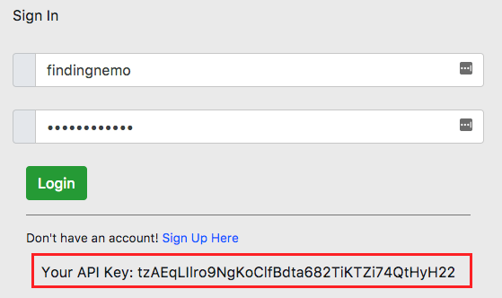

3\. Launch the [CloudFormation](http://docs.aws.amazon.com/AWSCloudFormation/latest/UserGuide/Welcome.html) template for your selected region to stand up the core workshop infrastructure.

The CloudFormation template will launch the following:

* VPC with public subnets, routes and Internet Gateway
* ECS cluster
* EC2 instance with security groups (inbound tcp 22, 80, 5000) and joined to the ECS cluster
* ECR repositories for your container images
* Parameter store to hold values for API Key and fulfillment API endpoint
* Cloud9 Development Environment

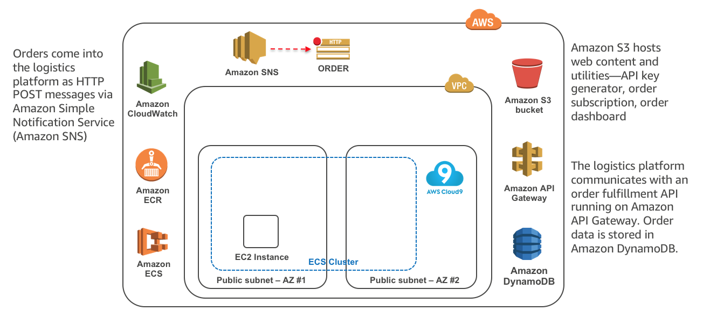

*Note: SNS Orders topic, S3 assets, API Gateway and DynamoDB tables are admin components that run in the workshop administrator's account.  If you're at a live AWS event, this will be provided by the workshop facilitators.  We're working on packaging up the admin components in a separate admin CloudFormation template, so you will be able to run this workshop without at your office or home.*

Open the CloudFormation launch template link below for the region you selected in Step 1 in a new tab.  The link will load the CloudFormation Dashboard and start the stack creation process in the chosen region.

Region | Launch Template
------------ | -------------
**N.Virginia** (us-east-1) | 

The template will automatically bring you to the CloudFormation Dashboard and start the stack creation process in the specified region. Do not change anything on the first screen. Click **Next** to continue.

5\. On the Specify Details step of the Create Stack process, enter values for the following fields:

* **Stack Name** - the stack name is an identifier that helps you find a particular stack from a list of stacks, e.g. interstella
* **EnvironmentName** - this field is to used to tag resources created by CloudFormation, e.g. interstella.

*Important: please use only lowercase letters. The ECR repository leverages this CloudFormation parameter and ECR repository names can only contain lower case letters.*

* **InterstellaApiKey** - enter the **API key** generated in Step 3
* **InterstellaApiEndpoint** - keep this as default UNLESS the workshop admins provide you with a different fulfillment API endpoint to use

All other fields can be left as their default values.

Click **Next** to continue.

6\. No changes or inputs are required on the Options page.  Click **Next** to move on to the Review page.

7\. Acknowledge that CloudFormation will create IAM resources and create the stack.

On the Review page, scroll down to the **Capabilities** section and click on the checkbox next to *"I acknowledge that AWS CloudFormation might create IAM resources with custom names."*.  If you do not check this box, the stack creation will fail.

Click **Create** to launch the CloudFormation stack.

### Checkpoint:
The CloudFormation stack will take a few minutes to launch.  Periodically check on the stack creation process in the CloudFormation Dashboard. If no stack shows up immediately, click the refresh button at the top right hand corner of your screen.  Your stack should show status **CREATE\_COMPLETE** in roughly 5-10 minutes.  If you select the box next to your stack and click on the **Events** tab, you can see what step it's on. 

If there was an [error](http://docs.aws.amazon.com/AWSCloudFormation/latest/UserGuide/troubleshooting.html#troubleshooting-errors) during the stack creation process, CloudFormation will rollback and terminate.  You can investigate and troubleshoot by looking in the Events tab.  Any errors encountered during stack creation will appear in the event stream as a failure.

Go ahead and start reading the next section while your stack creates.

[*^ back to top*](#interstella-gtc-monolith-to-microservices-with-containers)
* * *

## Lab 1 - Containerize Interstella's logistics platform:

Whoa! Turns out Interstella's infrastructure has been running directly on EC2 virtual machines this entire time! Our first step will be to modernize how our code is packaged by containerizing Interstella's current logistics platform, which we'll also refer to as the monolith application.  To do this, you will create a [Dockerfile](https://docs.docker.com/engine/reference/builder/), which is essentially a recipe for [Docker](https://aws.amazon.com/docker) to build a container image.  The CloudFormation template created an [AWS Cloud9](https://aws.amazon.com/cloud9/) development environment which is where you'll author the Dockerfile, build the container image, and run it to confirm it's able to process orders.

[Containers](https://aws.amazon.com/what-are-containers/) are a way to package software (e.g. web server, proxy, batch process worker) so that you can run your code and all of its dependencies in a resource isolated process. You might be thinking, "Wait, isn't that a virtual machine (VM)?" Containers virtualize the operating system, while VMs virtualize the hardware. Containers provide isolation, portability and repeatability, so your developers can easily spin up an environment and start building without the heavy lifting.  More importantly, containers ensure your code runs in the same way anywhere, so if it works on your laptop, it will also work in production.

### Here's what you're going to work on in lab 1:

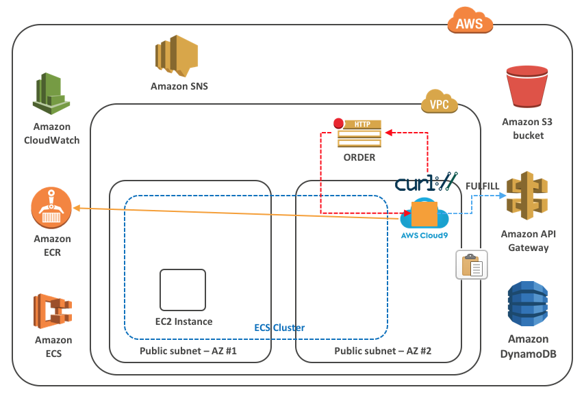

*Reminder: You'll see SNS topics, S3 bucket, API Gateway and DynamoDB in the diagram.  These are  provided by Interstella HQ for communicating orders and fulfilling orders.  They're in the diagram to show you the big picture as to how orders come in to the logistics platform and how orders get fulfilled*

* * *

### Instructions:

1\. Access your AWS Cloud9 Development Environment.

In the AWS Management Console, go to the [Cloud9 Dashboard](https://console.aws.amazon.com/cloud9/home) and find your environment which should be prefixed with the **EnvironmentName** specifed in the CloudFomation template. You can also find the name of your environment in the CloudFormation outputs as Cloud9EnvName. Click **Open IDE**

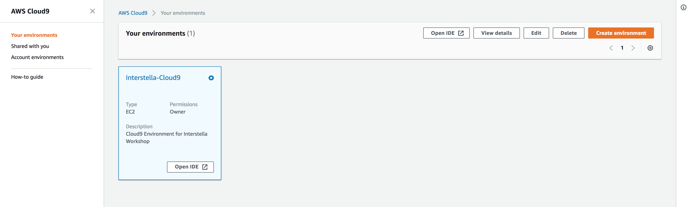

2\. Familiarize yourself with the Cloud9 Environment.

On the left pane (Blue), any files downloaded to your environment will appear here in the file tree. In the middle (Red) pane, any documents you open will show up here. Test this out by double clicking on README.md in the left pane and edit the file by adding some arbitrary text. Then save it by clicking **File** and **Save**. Keyboard shortcuts will work as well.

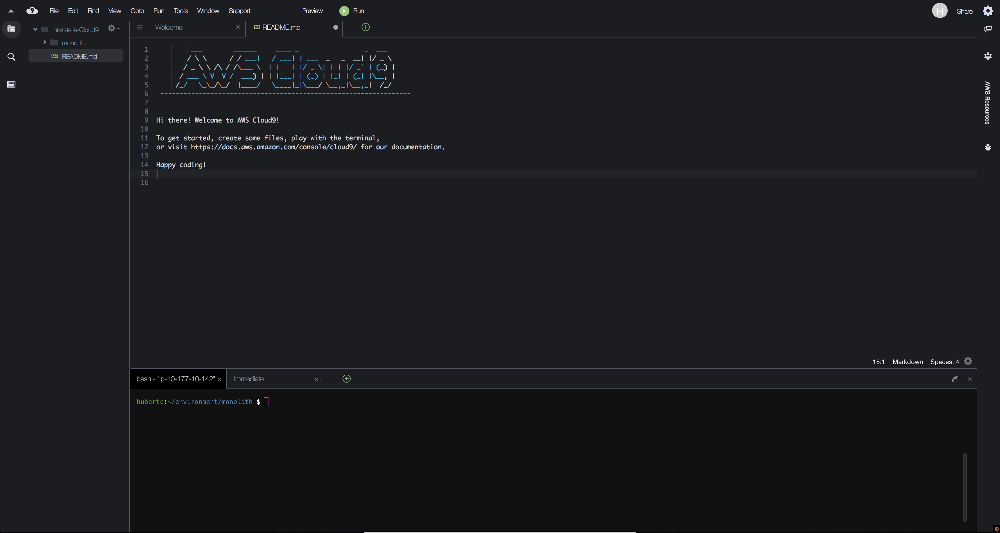

On the bottom, you will see a bash shell (Yellow). For the remainder of the lab, use this shell to enter all commands.  You can also customize your Cloud9 environment by changing themes, moving panes around, etc.

3\. Download the logistics application source, requirements file, and a draft [Dockerfile](https://docs.docker.com/engine/reference/builder/) from Interstella HQ. We'll also take this opportunity to install the [ECR Credential Helper](https://github.com/awslabs/amazon-ecr-credential-helper) to help with authentication (don't worry, we'll explain later).

<pre>
$ aws s3 sync s3://www.interstella.trade/code/monolith/ monolith/
$ cd monolith
$ chmod +x installcredhelper.sh
$ sudo ./installcredhelper.sh
</pre>

*Note: This is using the [AWS CLI](https://aws.amazon.com/cli/) which comes bundled with Cloud9, and we authorize access to S3 through [AWS Managed Temporary Credentials](https://docs.aws.amazon.com/cloud9/latest/user-guide/auth-and-access-control.html#auth-and-access-control-temporary-managed-credentials). Also notice the downloaded files appeared in your Cloud9 file tree.*

4\. Review the draft Dockerfile and add the missing instructions indicated by comments in the file.

*Note: If you're already familiar with how Dockerfiles work and want to focus on breaking the monolith apart into microservices, skip down to ["HINT: Final Dockerfile"](#final-dockerfile) near the end of step 5, create a Dockerfile in the monolith directory with the hint contents, build the "monolith" image, and continue to step 6.  Otherwise continue on...*

One of Interstella's developers started working on a Dockerfile in her free time, but she was pulled to a high priority project to implement source control (which also explains why you're pulling code from S3).

In the Cloud9 file tree, click on the **monolith** folder to expand it, and double-click on **Dockerfile.draft** to open the file for editing.

*Note: If you would prefer to use the bash shell and a text editor like vi or emacs instead, you're welcome to do so.*

Review the contents, and you'll see a few comments at the end of the file noting what still needs to be done.  Comments are denoted by a "#".

Docker builds container images by stepping through the instructions listed in the Dockerfile.  Docker is built on this idea of layers starting with a base and executing each instruction that introduces change as a new layer.  It caches each layer, so as you develop and rebuild the image, Docker will reuse layers (often referred to as intermediate layers) from cache if no modifications were made.  Once it reaches the layer where edits are introduced, it will build a new intermediate layer and associate it with this particular build.  This makes tasks like image rebuild very efficient, and you can easily maintain multiple build versions.

For example, in the draft file, the first line - `FROM ubuntu:14.04` - specifies a base image as a starting point.  The next instruction - `RUN apt-get -y update` - creates a new layer where Docker updates package lists from the Ubuntu repositories.  This continues until you reach the last instruction which in most cases is an `ENTRYPOINT` *(hint hint)* or executable being run.

Add the remaining instructions to Dockerfile.draft.

HINT: Helpful links for completing Dockefile.draft

<pre>
Here are links to external documentation to give you some ideas:

#[TODO]: Copy monolith.py and requirements file into container image

- Consider the [COPY](https://docs.docker.com/engine/reference/builder/#copy) command
- You're copying both the monlith.py and requirements.txt from the monolith directory on your EC2 instance into the working directory of the container, which can be specified as "."

#[TODO]: Install dependencies listed in the requirements.txt file using pip

- Consider the [RUN](https://docs.docker.com/engine/reference/builder/#run) command
- More on [pip and requirements files](https://pip.pypa.io/en/stable/user_guide/#requirements-files)
- We're using pip and python binaries from virtualenv, so use "bin/pip" for your command

#[TODO]: Specify a listening port for the container

- Consider the [EXPOSE](https://docs.docker.com/engine/reference/builder/#expose) command
- App listening portNum can be found in the app source - monolith.py

#[TODO]: Run monolith.py as the final step. We want this container to run as an executable. Looking at ENTRYPOINT for this?

- Consider the [ENTRYPOINT](https://docs.docker.com/engine/reference/builder/#entrypoint) command
- Our ops team typically runs 'bin/python monolith.py' to launch the application on our servers; note that we use the python binary that comes with virtualenv.
</pre>

Once you're happy with your additions OR if you get stuck, you can check your work by comparing your work with the hint below.

HINT: Completed Dockerfile

<pre>
FROM ubuntu:14.04
RUN apt-get -y update
RUN apt-get -y install \
    git \
    wget \
    python-dev \
    python-virtualenv \
    libffi-dev \
    libssl-dev
WORKDIR /root
ENV PRODUCT monolith
RUN wget https://bootstrap.pypa.io/get-pip.py \
    && python get-pip.py
WORKDIR interstella
RUN virtualenv ${PRODUCT}
WORKDIR ${PRODUCT}
RUN bin/pip install --upgrade pip && \
    bin/pip install requests[security]
COPY ./monolith.py .
COPY ./requirements.txt .
RUN bin/pip install -r requirements.txt
EXPOSE 5000
ENTRYPOINT ["bin/python", "monolith.py"]
</pre>

If your Dockerfile looks good, rename your file from "Dockerfile.draft" to "Dockerfile" and continue to the next step.

<pre>
$ mv Dockerfile.draft Dockerfile
</pre>

5\. Build the image using the [Docker build](https://docs.docker.com/engine/reference/commandline/build/) command.

This command needs to be run in the same directory where your Dockerfile is. **Note the trailing period** which tells the build command to look in the current directory for the Dockerfile.

<pre>
$ docker build -t monolith .
</pre>

You'll see a bunch of output as Docker builds all layers of the image.  If there is a problem along the way, the build process will fail and stop (red text and warnings along the way are fine as long as the build process does not fail).  Otherwise, you'll see a success message at the end of the build output like this:

<pre>
Step 15/15 : ENTRYPOINT bin/python monolith.py
---> Running in 188e00e5c1af
---> 7f51e5d00cee
Removing intermediate container 188e00e5c1af
Successfully built 7f51e5d00cee
</pre>

*Note: Your output will not be exactly like this, but it will be similar.*

Awesome, your Dockerfile built successfully, but our developer didn't optimize the Dockefile for the microservices effort later.  Since you'll be breaking apart the monolith codebase into microservices, you will be editing the source code (i.e. monolith.py) often and rebuilding this image a few times.  Looking at your existing Dockerfile, what is one thing you can do to improve build times?

HINT

Remember that Docker tries to be efficient by caching layers that have not changed.  Once change is introduced, Docker will rebuild that layer and all layers after it.

Edit monolith.py by adding an arbitrary comment somewhere in the file.  If you're not familiar with Python, [comments](https://docs.python.org/2/tutorial/introduction.html) start with the hash character, '#' and are essentially ignored when the code is interpreted.

For example, here a comment (`# Author: Mr Bean`) was added before importing the time module:
<pre>
# Author: Mr Bean

import time
from flask import Flask
from flask import request
import json
import requests
....
</pre>

Rebuild the image using the 'docker build' command from above and notice Docker references layers from cache, and starts rebuilding layers starting from Step 11, when monolith.py is copied over since that is where change is first introduced:

<pre>
Step 8/15 : RUN virtualenv ${PRODUCT}
 ---> Using cache
 ---> f53443a081bf
Step 9/15 : WORKDIR ${PRODUCT}
 ---> Using cache
 ---> 8ed7d4c92e24
Step 10/15 : RUN bin/pip install --upgrade pip &&     bin/pip install requests[security]
 ---> Using cache
 ---> 68cf52215eb7
Step 11/15 : COPY ./monolith.py .
 ---> 313b28d629bb
Removing intermediate container 3b9db00c476d
Step 12/15 : COPY ./requirements.txt .
 ---> 24aea2192c09
Removing intermediate container 88fb9b72087e
Step 13/15 : RUN bin/pip install -r requirements.txt
 ---> Running in 30794a84a399
Collecting Flask==0.12.2 (from -r requirements.txt (line 1))
</pre>

Try reordering the instructions in your Dockerfile to copy the monolith code over after the requirements are installed.  The thinking here is that monolith.py will see more changes than the dependencies noted in requirements.txt, so why rebuild requirements every time when we can just have it be another cached layer.

Edit your Dockerfile with what you think will improve build times and compare it with the Final Dockerfile hint below.

#### Final Dockerfile

HINT: Final Dockerfile

<pre>
FROM ubuntu:14.04
RUN apt-get -y update
RUN apt-get -y install \
    git \
    wget \
    python-dev \
    python-virtualenv \
    libffi-dev \
    libssl-dev
WORKDIR /root
ENV PRODUCT monolith
RUN wget https://bootstrap.pypa.io/get-pip.py \
    && python get-pip.py
WORKDIR interstella
RUN virtualenv ${PRODUCT}
WORKDIR ${PRODUCT}
RUN bin/pip install --upgrade pip && \
    bin/pip install requests[security]
COPY ./requirements.txt .
RUN bin/pip install -r requirements.txt
COPY ./monolith.py .
EXPOSE 5000
ENTRYPOINT ["bin/python", "monolith.py"]
</pre>

To see the benefit of your optimizations, you'll need to first rebuild the monolith image using your new Dockerfile (use the same build command at the beginning of step 5).  Then, introduce a change in monolith.py (e.g. add another arbitrary comment) and rebuild the monolith image again.  Docker cached the requirements during the first rebuild after the re-ordering and references cache during this second rebuild.  You should see something similar to below:

<pre>
Step 11/15 : COPY ./requirements.txt .
 ---> Using cache
 ---> 448f69a6bf1b
Step 12/15 : RUN bin/pip install -r requirements.txt
 ---> Using cache
 ---> ff783b9e3fda
Step 13/15 : COPY ./monolith.py .
 ---> f5583e78794b
Removing intermediate container a4ace03b75dd
Step 14/15 : EXPOSE 5000
</pre>

You now have a Docker image built.  The -t flag names the resulting container image.  List your docker images and you'll see the "monolith" image in the list.

<pre>
$ docker images
</pre>

Here's a sample output, note the monolith image in the list:

<pre>
whiterabbit:~/environment/monolith $ docker images
REPOSITORY               TAG        IMAGE ID        CREATED             SIZE
monolith                 latest     87d3de20e191    17 seconds ago      532 MB
&lt;none&gt;                   &lt;none&gt;     850d78c7aa5f    27 minutes ago      735 MB
golang                   1.9        1a34fad76b34    8 days ago          733 MB
ubuntu                   14.04      3aa18c7568fc    8 days ago          188 MB
amazon/amazon-ecs-agent  latest     96e5393c89d4    6 weeks ago         25.4 MB
</pre>

*Note: Your output will not be exactly like this, but it will be similar.*

Notice the image is also tagged as "latest".  This is the default behavior if you do not specify a tag of your own, but you can use this as a freeform way to identify an image, e.g. monolith:1.2 or monolith:experimental.  This is very convenient for identifying your images and correlating an image with a branch/version of code as well.

6\. Run the docker container and test the logistics platform running as a container to make sure it is able to fulfill an order.

Use the [docker run](https://docs.docker.com/engine/reference/run/) command to run your image; the -p flag is used to map the host listening port to the container listening port.

<pre>
$ docker run -p 5000:5000 monolith
</pre>

Here's sample output as the application starts:

<pre>
whiterabbit:~/environment/monolith $ docker run -p 5000:5000 monolith
INFO:botocore.vendored.requests.packages.urllib3.connectionpool:Starting new HTTP connection (1): 169.254.169.254
INFO:botocore.vendored.requests.packages.urllib3.connectionpool:Starting new HTTP connection (1): 169.254.169.254
INFO:botocore.vendored.requests.packages.urllib3.connectionpool:Starting new HTTPS connection (1): ssm.us-east-2.amazonaws.com
INFO:werkzeug: * Running on http://0.0.0.0:5000/ (Press CTRL+C to quit)
INFO:werkzeug: * Restarting with stat
INFO:botocore.vendored.requests.packages.urllib3.connectionpool:Starting new HTTP connection (1): 169.254.169.254
INFO:botocore.vendored.requests.packages.urllib3.connectionpool:Starting new HTTP connection (1): 169.254.169.254
INFO:botocore.vendored.requests.packages.urllib3.connectionpool:Starting new HTTPS connection (1): ssm.us-east-2.amazonaws.com
WARNING:werkzeug: * Debugger is active!
INFO:werkzeug: * Debugger PIN: 410-791-646
</pre>

*Note: Your output will not be exactly like this, but it will be similar.*

To test order processing, send a sample JSON payload simulating an incoming order using a utility like [cURL](https://curl.haxx.se/), which is bundled with Cloud9.

Click on the plus sign next to your tabs and choose **New Terminal** or click **Window** -> **New Terminal** from the Cloud9 menu to open a new shell session to run the following curl command.

<pre>
$ curl -H "Content-Type: application/json" -X POST -d '{"Message":{"bundle":"1"}}' http://localhost:5000/order/
</pre>

You should see the curl command return "Your order has been fulfilled".

Switch back to the original shell tab where you're running the monolith container to check the output from the logistics platform.

The monolith container runs in the foreground with stdout/stderr printing to the screen, so when the simulated order payload `{"Message":{"bundle":"1"}}` is received, you should see the order get processed and return a `200`. "OK".

Here is sample output:

<pre>
Gathering Requested Items
Getting Iridium
Getting Magnesite
Trying to send a request to the API
API Status Code: 200
Bundle fulfilled
INFO:werkzeug:18.218.142.240 - - [06/Feb/2018 09:51:10] "POST /order/ HTTP/1.1" 200 -
</pre>

In the tab you have the running container, type **Ctrl-C** to stop the running container.  Notice, the container ran in the foreground with stdout/stderr printing to the console.  In a production environment, you would run your containers in the background as processes and configure some logging destination.  We'll worry about logging later, but you can try running the container in the background using the -d flag.

<pre>
$ docker run -d -p 5000:5000 monolith
</pre>

List running docker containers with the [docker ps](https://docs.docker.com/engine/reference/commandline/ps/) command to make sure the monolith is running.

<pre>
$ docker ps
</pre>

You should see monolith running in the list.  Additionally confirm that orders are being processed by attaching stdin/stdout/stderr to the container with the [docker attach](https://docs.docker.com/engine/reference/commandline/attach/) command and using the same curl command (from the other tab where you ran curl earlier) to send another simulated order JSON payload to your container.  The attach command expects a container name, and you can find the running name of your container from the output of the 'docker ps' command (last column on the right).  If the container is running as expected, you should see output from the simulated order being processed.

<pre>
$ docker attach <b><i>CONTAINER_NAME</i></b>
</pre>

Here's sample output from the above commands:

<pre>
whiterabbit:~/environment/monolith $ docker run -d -p 5000:5000 monolith
21ee17c20648c994206895aa7bee382ad55f914a4c8551f01265084d36283c12
whiterabbit:~/environment/monolith $ docker ps
CONTAINER ID        IMAGE                            COMMAND                  CREATED             STATUS              PORTS                    NAMES
21ee17c20648        monolith                         "bin/python monoli..."   3 seconds ago       Up 2 seconds        0.0.0.0:5000->5000/tcp   distracted_volhard
8b97f6eb4581        amazon/amazon-ecs-agent:latest   "/agent"                 3 hours ago         Up 3 hours                                   ecs-agent
whiterabbit:~/environment/monolith $ docker attach distracted_volhard
Gathering Requested Items
Getting Iridium
Getting Magnesite
Trying to send a request to the API
API Status Code: 200
Bundle fulfilled
INFO:werkzeug:96.40.120.185 - - [06/Feb/2018 10:14:02] "POST /order/ HTTP/1.1" 200 -
</pre>

In the sample output above, the container was assigned the name "disatracted_volhard".  Names are arbitrarily assigned.  You can also pass the docker run command a name option if you want to specify the running name.  You can read more about it in the [Docker run reference](https://docs.docker.com/engine/reference/run/).  Kill the container using **Ctrl-C** now that we know it's working properly.

7\. Now that you have a working Docker image, tag and push the image to [Elastic Container Registry (ECR)](https://aws.amazon.com/ecr/).  ECR is a fully-managed Docker container registry that makes it easy to store, manage, and deploy Docker container images. In the next lab, we'll use ECS to pull your image from ECR.

In the AWS Management Console, navigate to [Repositories](https://console.aws.amazon.com/ecs/home#/repositories) in the ECS dashboard.  You should see repositories for monolith and each microservice (iridium and magnesite).  These were created by CloudFormation and prefixed with the *EnvironmentName* (in the example below, I used 'interstella' as my *EnvironmentName*) specified during stack creation.

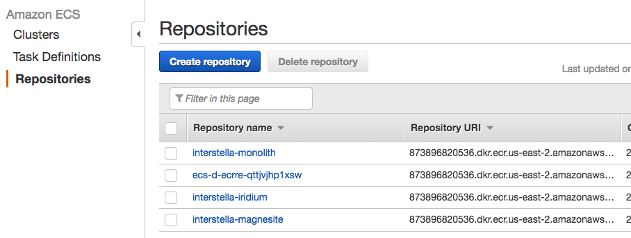

Click on the repository name for the monolith, and note down the Repository URI (you will use this value again in the next lab):

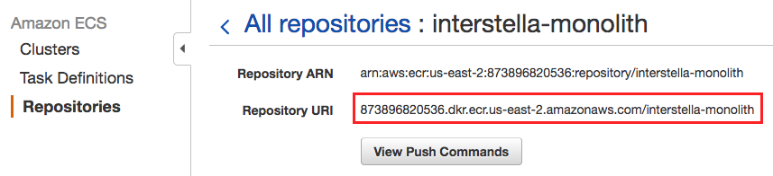

*Note: Your repository URI will be unique.*

Tag and push your container image to the monolith repository.

<pre>
$ docker tag monolith:latest <b><i>ECR_REPOSITORY_URI</i></b>:latest
$ docker push <b><i>ECR_REPOSITORY_URI</i></b>:latest
</pre>

When you issue the push command, Docker pushes the layers up to ECR.  

Here's sample output from these commands:

<pre>
whiterabbit:~/environment/monolith $ docker tag monolith:latest 873896820536.dkr.ecr.us-east-2.amazonaws.com/interstella-monolith:latest
whiterabbit:~/environment/monolith $ docker push 873896820536.dkr.ecr.us-east-2.amazonaws.com/interstella-monolith:latest
The push refers to a repository [873896820536.dkr.ecr.us-east-2.amazonaws.com/interstella-monolith]
0f03d692d842: Pushed
ddca409d6822: Pushed
d779004749f3: Pushed
4008f6d92478: Pushed
e0c4f058a955: Pushed
7e33b38be0e9: Pushed
b9c7536f9dd8: Pushed
43a02097083b: Pushed
59e73cf39f38: Pushed
31df331e1f23: Pushed
630730f8c75d: Pushed
827cd1db9e95: Pushed
e6e107f1da2f: Pushed
c41b9462ea4b: Pushed
latest: digest: sha256:a27cb7c6ad7a62fccc3d56dfe037581d314bd8bd0d73a9a8106d979ac54b76ca size: 3252
</pre>

*Note: Typically, you'd have to log into your ECR repo. However, you did not need to authenticate docker with ECR because the [Amazon ECR Credential Helper](https://github.com/awslabs/amazon-ecr-credential-helper) has been installed and configured for you on the Cloud9 Environment.  This was done earlier when you ran the installcredhelper.sh script. You can read more about the credentials helper in this [article](https://aws.amazon.com/blogs/compute/authenticating-amazon-ecr-repositories-for-docker-cli-with-credential-helper/).*

If you refresh the ECR repository page in the console, you'll see a new image uploaded and tagged as latest.

### Checkpoint:
At this point, you should have a working container for the monolith codebase stored in an ECR repository and ready to deploy with ECS in the next lab.

[*^ back to the top*](#interstella-gtc-monolith-to-microservices-with-containers)

* * *

## Lab 2 - Deploy your container using ECR/ECS:

Deploying individual containers is not difficult.  However, when you need to coordinate many container deployments, a container management tool like ECS can greatly simplify the task (no pun intended).

ECS refers to a JSON formatted template called a [Task Definition](http://docs.aws.amazon.com/AmazonECS/latest/developerguide/task_definitions.html) that describes one or more containers making up your application or service.  The task definition is the recipe that ECS uses to run your containers as a **task** on your EC2 instances or AWS Fargate.

INFO: What is a task?

A task is a running set of containers on a single host. You may hear or see 'task' and 'container' used interchangeably. Often, we refer to tasks instead of containers because a task is the unit of work that ECS launches and manages on your cluster. A task can be a single container, or multiple containers that run together. 

Fun fact: a task is very similar to a Kubernetes 'pod'.

Most task definition parameters map to options and arguments passed to the [docker run](https://docs.docker.com/engine/reference/run/) command which means you can describe configurations like which container image(s) you want to use, host:container port mappings, cpu and memory allocations, logging, and more.

In this lab, you will create a task definition and configure logging to serve as a foundation for deploying the containerized logistics platform stored in ECR with ECS.  In this lab, you'll be using the [EC2 launch type](https://docs.aws.amazon.com/AmazonECS/latest/developerguide/launch_types.html#launch-type-ec2), so you can get a feel for how it compares to the Fargate launch type when you start breaking apart the microservices in lab 4. The CloudFormation template launched an EC2 instance that's already joined to your ECS cluster. EC2 and Fargate launch types can co-exist in the same cluster.

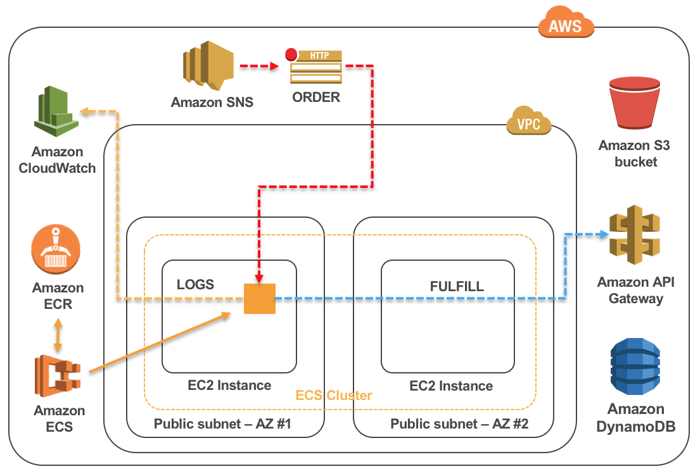

*Note: You will use the AWS Management Console for this lab, but remember that you can programmatically accomplish the same thing using the AWS CLI, SDKs, or CloudFormation.*

* * *

### Instructions:

1\. Create an ECS task definition that describes what is needed to run the monolith and enable logging.

In the AWS Management Console, navigate to [Task Definitions](https://console.aws.amazon.com/ecs/home#/taskDefinitions) in the ECS dashboard.  Click on **Create New Task Definition**.  Select **EC2** launch type compatibility and click **Next step**.

Enter a name for your Task Definition, (e.g.: `interstella-monolith`).  Leave Task Role and Network Mode as defaults.

Scroll down to "Container Definitions" and click **Add container**.

Enter values for the following fields:

* **Container name** - this is a friendly name for your container, not the name of the container image. e.g. interstella-monolith
* **Image** - this is a reference to the container image stored in ECR.  The format should be the same value you used to push the container to ECR - <pre><b><i>ECR_REPOSITORY_URI</i></b>:latest</pre>
* **Memory Limits** - select **Soft limit** from the drop down, and enter `128`.

*Note: This assigns a soft limit of 128MB of RAM to the container, but since it's a soft limit, it does have the ability to consume more available memory if needed.  A hard limit will kill the container if it exceeds the memory limit.  You can define both for flexible memory allocations.  Resource availability is one of the factors that influences container placement.  You can read more about [Container Definitions](http://docs.aws.amazon.com/AmazonECS/latest/APIReference/API_ContainerDefinition.html) in our documentation*

* **Port mappings** - enter `5000` for both host and container port.

*Note: You might be wondering how you can more than one of the same container on a single EC2 host since there could be conflicts based on the port mappings configuration.  ECS offers a dynamic port mapping feature when using the ALB as a load balancer for your container service.  We'll visit this in the next lab when adding an ALB to the picture*

Here's an example of what the container definition should look like up until this point (don't click **Add** yet, there's still logging which is covered in the next step):

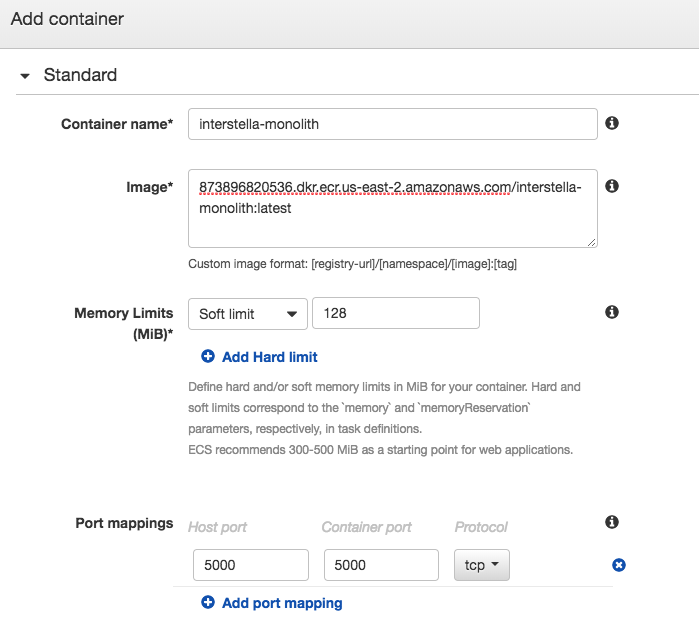

*Note: Your container image URI will be unique.*

2\. Configure logging to CloudWatch Logs in the container definition.

In the previous lab, you attached to the running container to get *stdout*, but no one should be doing that in production and it's good operational practice to implement a centralized logging solution.  ECS offers integration with [CloudWatch logs](https://docs.aws.amazon.com/AmazonCloudWatch/latest/logs/WhatIsCloudWatchLogs.html) through an awslogs driver that can be enabled in the container definition.

In the "Advanced container configuration" section, scroll down until you get to the "Storage and Logging" section where you'll find **Log Configuration**.

Select **awslogs** from the *Log driver* dropdown.

For *Log options*, enter values for the following:

* **awslogs-group** - enter `[EnvironmentName]-monolith`

*IMPORTANT: Replace `[EnvironmentName]` above with the EnvironmentName you specified when you created the CloudFormation stack.  The CloudFormation template created a [CloudWatch log group](https://docs.aws.amazon.com/AmazonCloudWatch/latest/logs/Working-with-log-groups-and-streams.html) for each service prefixed with the EnvironmentName parameter you specified when launching the stack.  For example, if your EnvironmentName was "interstella", the log group for the monolith would be "interstella-monolith".*

* **awslogs-region** - enter the AWS region of the log group (i.e.: the current region you're working in); the expected value is the region code.

HINT: Region codes

US East (N.Virginia) = us-east-1 
US East (Ohio) = us-east-2 
US West (Oregon) = us-west-2 
EU (Ireland) = eu-west-1 

For example, if you ran the CloudFormation stack in N.Virginia, you would enter 'us-east-1' for the awslogs-region.

The Log configuration should look something like this:

*Note: The screenshot above is an example from running the stack in us-east-2 with an EnvironmentName of "interstella".*

Leave all other fields as default, click **Add** to add this container definition to the task definition, and then click **Create** to finish creating the task definition.

3\. Run the task definition using the [Run Task](https://docs.aws.amazon.com/AmazonECS/latest/developerguide/ecs_run_task.html) method.

You should be at the task definition view where you can do things like create a new revision or invoke certain actions.  In the **Actions** dropdown, select **Run Task** to launch your container.

Configure the following fields:

* **Launch Type** - select **EC2**
* **Cluster** - select your workshop cluster from the dropdown menu, e.g. interstella
* **Task Definition** - select the task definition you created from the dropdown menu

Leave all remaining fields as their defaults and click **Run Task**.

*Note: There are many options to explore in the Task Placement section of the Run Task action, and while we will not touch on every configuration in this workshop, you can read more about [Scheduling Tasks](http://docs.aws.amazon.com/AmazonECS/latest/developerguide/scheduling_tasks.html) in our documentation.*

You'll see the task start in the **PENDING** state.

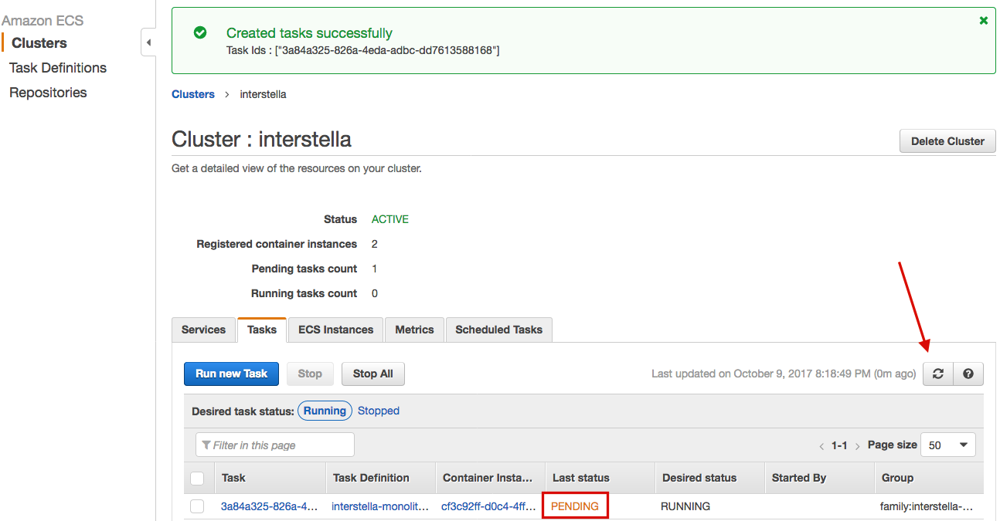

In a few seconds, click on the refresh button until the task changes to a **RUNNING** state.

4\. Test order processing by using cURL from your Cloud9 environment to send a sample order payload to the running logistics platform.

First we need to determine the IP address of the EC2 instance that is hosting your task.  Click on the Container Instance for your running task to load details of the EC2 instance that's running your task.  Note down the Public IP address to use with your curl command.

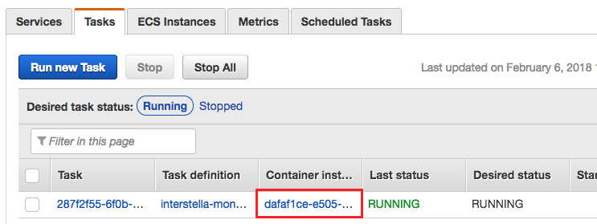

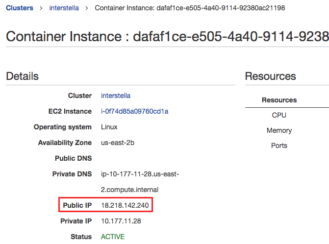

HINT: curl refresher

<pre>
$ curl -H "Content-Type: application/json" -X POST -d '{"Message":{"bundle":"1"}}' http://<b><i>EC2_PUBLIC_IP_ADDRESS</b></i>:5000/order/
</pre>

*Note: The EC2_PUBLIC_IP_ADDRESS value is the public IP address of the EC2 instance running your monolith container*

Run the curl command and check the CloudWatch log group for the monolith to confirm the test order was processed.

Navigate to the [CloudWatch Logs dashboard](https://console.aws.amazon.com/cloudwatch/home#logs:), and click on the monolith log group (e.g.: interstella-monolith).  Logging statements are written to log streams within the log group.  Click on the most recent log stream to view the logs.  The output should look very familiar from your testing in Lab 1 Step 6.

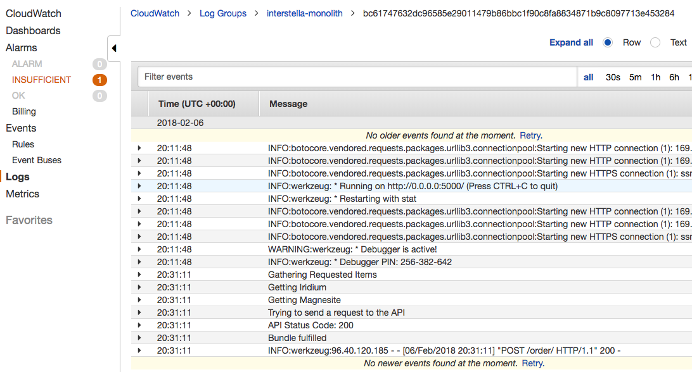

If the curl command was successful, stop the task by going to your cluster, select the **Tasks** tab, select the running monolith task, and click **Stop**.

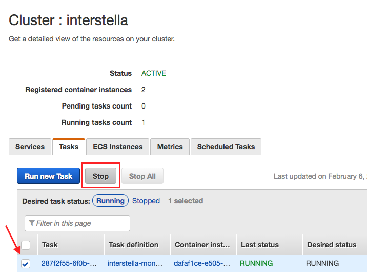

### Checkpoint:
Nice work!  You've created a task definition and are able to deploy the monolith container using ECS.  You've also enabled logging to CloudWatch Logs, so you can verify your container works as expected.

[*^ back to the top*](#interstella-gtc-monolith-to-microservices-with-containers)

* * *

## Lab 3 - Scale the logistics platform with an ALB:

The Run Task method you used in the last lab is good for testing, but we need to run the logistics platform as a long running process.  In addition, it would be helpful to maintain capacity in case any of our EC2 instances were to have an issue (always design and plan for failure).

In this lab, you will implement an Elastic Load Balancing [Appliction Load Balancer (ALB)](https://aws.amazon.com/elasticloadbalancing/) to front-end and distribute incoming orders to your running containers.  The integration between ECS and ALB offers a feature called dynamic port mapping for containers, which allows you to run multiple copies of the same container with the same listening port on the same host...*say that 10 times fast*.  The current task definition maps host port 5000 to container port 5000.  This means you would only be able to run one instance of that task on a specific host.  If the host port configuration in the task definition is set to 0, an ephemeral listening port is automatically assigned to the host and mapped to the container which still listens on 5000.  If you then tried to run two of those tasks, there wouldn't be a port conflict on the host because each task runs on it's own ephemeral port.  These hosts are grouped in a target group for the ALB to route traffic to.

What ties this all together is an **ECS Service**, which maintains a desired task count (i.e. n number of containers as long running processes) and integrates with the ALB (i.e. handles registration/deregistration of containers to the ALB). In this lab, you will configure the ALB, create/start the ECS service, and then subscribe the ALB endpoint to the orders SNS topic to start the order flow.  Up until now we have been testing with cURL, but you're ready to tap into our simulated order generator.

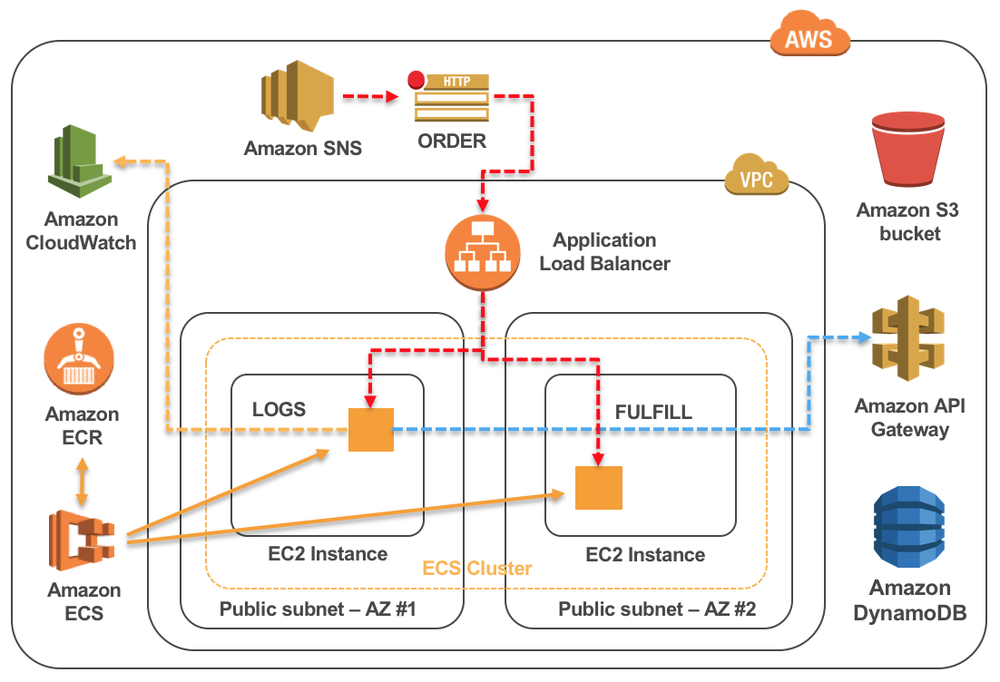

* * *

### Instructions:

1\. Create an Application Load Balancer.

In the AWS Management Console, navigate to the [EC2 dashboard](https://console.aws.amazon.com/ec2/v2/home).  Click on **Load Balancers** in the left menu under the **Load Balancing** section.  Click on **Create Load Balancer**.  Click on **Create** for an Application Load Balancer.

Give your ALB a name, e.g. interstella.

Scroll down to "Availability Zones", select the workshop VPC from the drop-down menu.  You can identify the workshop VPC in the list by the tag, which should be the same as the **EnvironmentName** CloudFormation parameter you provided when creating the stack.  Select the checkbox for the first Availability Zone (AZ) in the list to reveal associated subnets; click on the **Public subnet** for that AZ; the "Name" column will indicate which subnet is public.  Repeat this for the other AZ.

The settings should look similar to this:

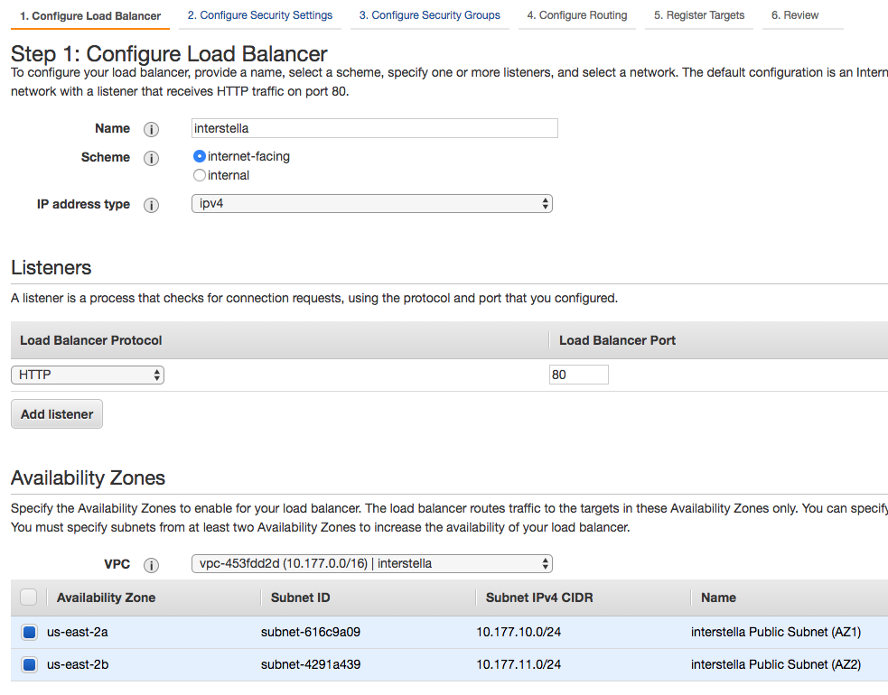

Leave all other settings as the defaults and click **Next: Configure Security Settings**.

Since we will not be setting up https, click **Next: Configure Security Groups**.

*Note: It's highly recommend in real world cases to implement SSL encryption for any production systems handling private information.  Our lab is designed to illustrate conceptual ideas and does not implement SSL for simplicity...and it's not a real company.*

You'll notice a [security group](https://docs.aws.amazon.com/elasticloadbalancing/latest/application/load-balancer-update-security-groups.html) that starts with your **EnvironmentName** from CloudFormation stack creation and has "LoadBalancerSecurityGroup" in the name.  This was provisioned by the CloudFormation template for your convenience.  Select that security group and click **Next: Configure Routing**.

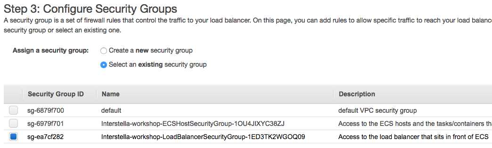

ALB routes incoming traffic to a target group associated with your ALB listener; targets in this case are the instances hosting your containers.

Enter a name for the new target group, e.g. interstella-monolith.  Enter `5000` for the port.  Leave other settings as defaults, and click **Next: Register Targets**.

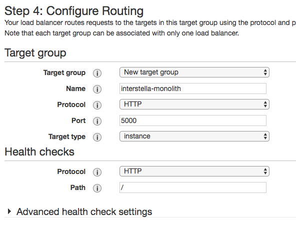

ECS handles registration of targets to your target groups, so do you **NOT** have to register targets in this step.  Click **Next: Review**, and on the next page, click **Create**.  It will take a few minutes for the ALB to become available, so you can move on to the next step.

2\. Update the task definition for the monolith to use dynamic port mapping.

Remember that one of the goals with the ALB is to be able to distribute orders to multiple containers running the logistics platform.  Dynamic port mapping enables you to run multiple containers listening on the same port to be deployed on the same host.

In order to take advantage of dynamic port mapping, create a new revision of your monolith task definition and remove the host port mapping in the container definition.  By leaving the host port blank, an ephemeral port will be assigned and ECS/ALB integration will handle the mapping and target group registration.

Go to [Task Definitions](https://console.aws.amazon.com/ecs/home#/taskDefinitions) in the ECS dashboard.

Select the monolith task definition and click **Create new revision**.

Scroll down to the "Container Definitions" section and click on the existing container to edit it.

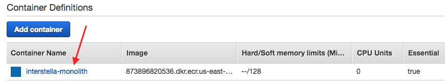

In the Port mappings section, delete the *Host port* configuration (previously set to 5000).

Here's what the new task definition should look like:

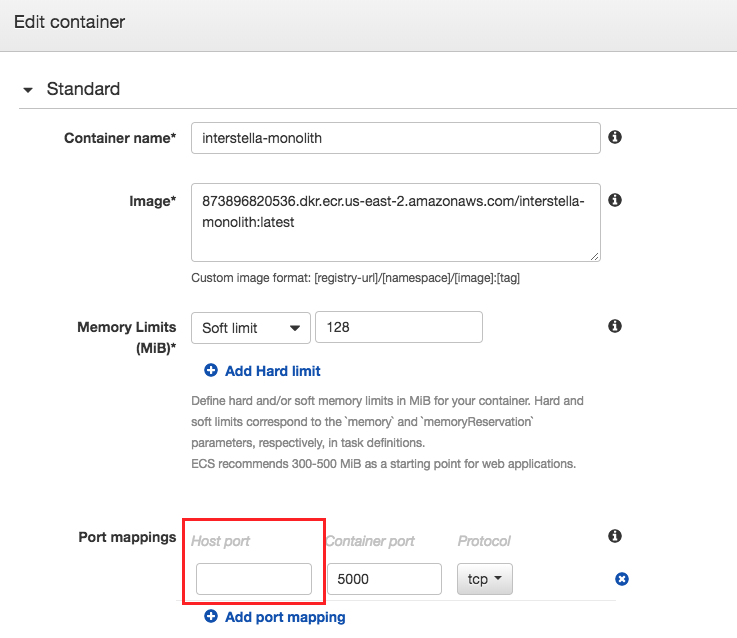

Click **Update** to save the changes to the container definition, and click **Create** to create the new revision of your task definition.

3\. Tie it all together by creating an ECS Service to maintain a desired number of running tasks and use the ALB created in step 1.

INFO: What is a service and how does it differ from a task??

An [ECS service](https://docs.aws.amazon.com/AmazonECS/latest/developerguide/ecs_services.html) is a concept where ECS allows you to run and maintain a specified number (the "desired count") of instances of a task definition simultaneously in an ECS cluster. 

tl;dr a **Service** is comprised of multiple **tasks** and will keep them up and running. See the link above for more detail.

You should still be on the screen showing the new revision of the task definition you just created.  Under the **Actions** drop down, choose **Create Service**.

*Note: Your task def name and version may not be the same as the above screenshot*

Configure the following fields:

* **Launch Type** - select **EC2**
* **Cluster** - select your ECS cluster from the dropdown menu, e.g. interstella
* **Service Name** - enter a name for the service, e.g. interstella-monolith
* **Number of tasks** - enter `1` for now 

Leave other settings as defaults and click **Next Step**

On the next page, select **Application Load Balancer** for **Load balancer type**.

You'll see a **Load balancer name** drop-down menu appear.  Select the ALB you created in Step 1.

In the "Container to load balance" section, select the **Container name : port** combo from the drop-down menu that corresponds to the task definition you edited in step 2.

Your progress should look similar to this:

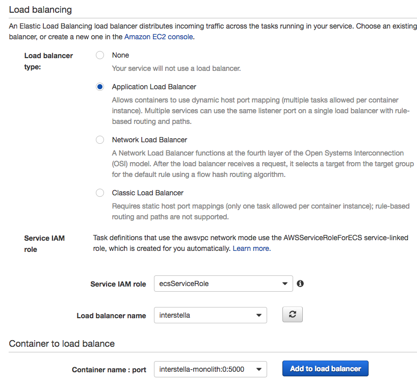

Click **Add to load balancer**.  More fields related to the container will appear.

For **Listener Port**, select **80:HTTP** from the drop-down.

For **Target Group Name**, select the target group you created in step 1 from the drop-down, e.g. interstella-monolith.

Your progress should look similar to this:

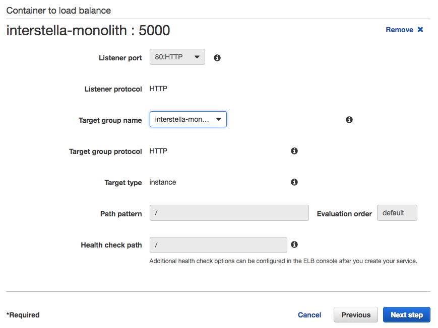

Leave the other fields as defaults and click **Next Step**.

Skip the Auto Scaling configuration by clicking **Next Step**.

*Note: ECS supports Task auto scaling which can automatically increase/decrease your desired task count based on dynamic metrics.  We'll skip this, but this is a very useful feature for production workloads.*

Click **Create Service** on the Review page.

*Note: There were many other configuration options we didn't touch, and you can read more about [ECS Services](http://docs.aws.amazon.com/AmazonECS/latest/developerguide/ecs_services.html) and [ALB Listeners](http://docs.aws.amazon.com/elasticloadbalancing/latest/application/load-balancer-listeners.html) in our documentation*

Once the Service is created, click **View Service** and you'll see your task definition has been deployed as a service.  Explore the page to see details related to your ECS Service, e.g. desired count, running count, task definition.

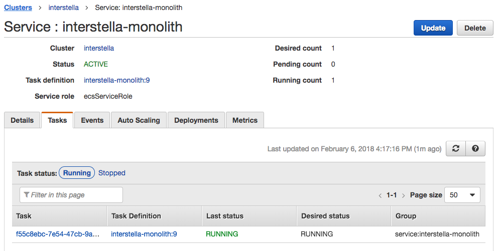

4\. Subscribe the ALB endpoint to the SNS order topic using the [API Key Management Portal](https://www.interstella.trade/getkey.html) to start receiving orders from Interstella HQ to test your service.

First you need the public DNS name of your ALB endpoint.  Go to the [EC2 dashboard](https://console.aws.amazon.com/ec2/v2/home), click on **Load Balancers** under the **Load balancing** section of the left menu.  Select the ALB you created and look for the **DNS Name** listed in the Description tab.

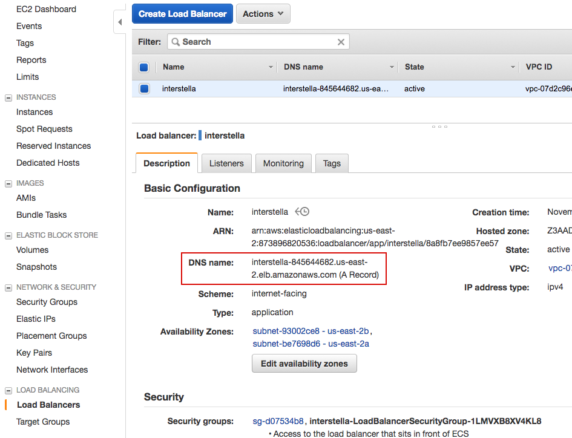

Open the [API Key Management Portal](http://www.interstella.trade/getkey.html) in a new tab.  If you're not already logged in, you'll need to login with the username and password you created during the Workshop Setup.

Enter the ALB endpoint in the SNS Subscription text field using the following format:

<pre>
http://<b><i>ALB_ENDPOINT_DNS_NAME</i></b>/order/
</pre>

Click on **Subscribe to Orders topic** to subscribe to the Orders SNS topic.  You'll see a pop-up saying "pending confirmation" confirming the subscription has been submitted.

Here's an example:

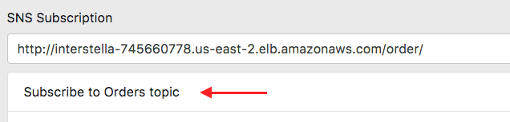

*Note: Your ALB endpoint will be unique*

Navigate to the CloudWatch Logs dashboard and review the latest log stream for the monolith log group.  You should see logs corresponding to order proessing along with GET requests in your log stream.  The GET requests are the ALB health checks.

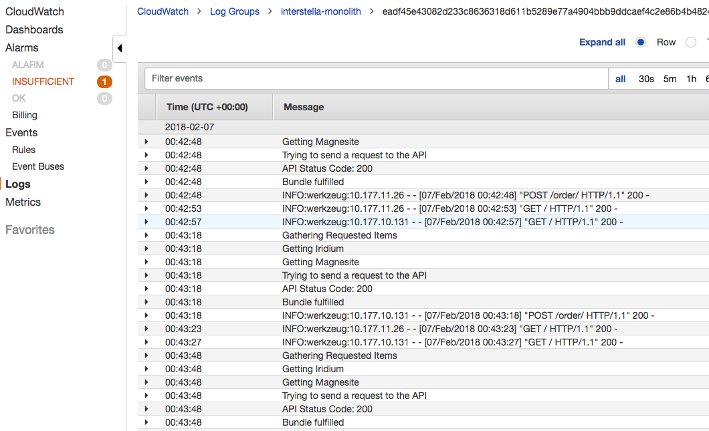

### Checkpoint:
Sweet! You've implemented an ALB as a way to distribute incoming HTTP orders to multiple instances of Interstella's containerized logistics platform deployed as an ECS Service.

[*^ back to the top*](#interstella-gtc-monolith-to-microservices-with-containers)

* * *

## Lab 4: Incrementally build and deploy each microservice using Fargate

It's time to break apart Interstella's monolith logistics platform into microservices. To help with this, let's see how the monolith works in more detail.

> When a request first comes in, all two resources are gathered in sequence. Once confirmed that everything has been gathered, they are fulfilled through a fulfillment API running on the [Amazon API Gateway](https://aws.amazon.com/api-gateway/). Logically, you can think of this as three separate services. One per resource and one for fulfillment. The goal for this lab is to remove the resource processing functions from the monolith and implement them as their own microservice.

> We must define service contracts between your microservice and any other services it will have to access. In this lab, the flow will be:

> 1. Customer orders are delivered as HTTP POST messages from an SNS topic - there will be a topic per resource.  The payload of the order is JSON (e.g.`{"iridium": 1}`).
> 2. The ALB will deliver the order payload according to the request path
> 3. Microservice gathers resources and sends JSON to the monolith via a new integration hook for fulfillment.
> 4. This integration hook is in monolith.py and is named _glueFulfill()_.

> When moving to microservices, there are some patterns that are fairly common. One is to rewrite your entire application with microservices in mind. While this is nice and you have great code to work with going forward, it's often not feasible.

> Hence, Interstella's lead engineer has chosen to move forward with the [Strangler Application pattern](https://www.martinfowler.com/bliki/StranglerApplication.html) which they've had success with in the past. You will be taking functionality out of the monolith and making those into microservices while creating integrations into the monolith to still leverage any legacy code. This introduces less risk to the overall migration and allows teams to iterate quickly on the services that have been moved out. Eventually, there will be very little left in the monolith, effectively strangling it down to just a fulfillment service; this too could eventually be modernized and replaced.

> The ALB has another feature called [path-based routing](https://docs.aws.amazon.com/elasticloadbalancing/latest/application/load-balancer-listeners.html#path-conditions), which routes traffic based on URL path to particular target groups.  This means you will only need a single instance of the ALB to host your microservices.  The monolith fulfillment service will receive all traffic to the default path, '/'.  Iridium and magnesite services will be '/iridium' and '/magnesite', respectively.

Here's what you will be implementing:

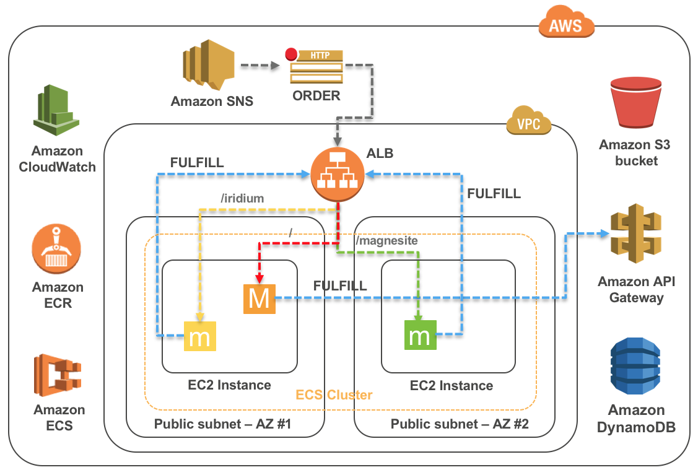

*Note: The capital 'M' denotes the monolith and 'm' a microservice*

You'll be using [Fargate](https://aws.amazon.com/fargate/) to deploy these microservices.  Notice in the diagram that you do not have to provide EC2 instances to host Fargate tasks - this is entirely managed by AWS.  Fargate containers launch with a networking mode called [awsvpc](https://docs.aws.amazon.com/AmazonECS/latest/developerguide/task-networking.html), which gives ECS tasks the same networking properties of EC2 instances.  Tasks will essentially receive their own [elastic network interface](https://docs.aws.amazon.com/AWSEC2/latest/UserGuide/using-eni.html).  This offers benefits like task-specific security groups.  Let's get started!

* * *

### Instructions:

1\. First, build the Iridium service container image and push it to ECR.

You'll use your Cloud9 environment to do this.  If you've closed the tab, go to the [Cloud9 Dashboard](https://console.aws.amazon.com/cloud9/home) and find your environment. Click "**Open IDE**"

Our dev team already prepared the service code and Dockerfile for iridium production, so you just have to build the Docker image.  These are similar to the docker build steps from Lab 1 when you built the monolith.  Download the iridium application source, requirements file, and Dockerfile from Interstella HQ.

<pre>
$ aws s3 sync s3://www.interstella.trade/code/iridium/ iridium/
$ cd iridium
</pre>

2\. Build the new iridium production Docker image.

<pre>
$ docker build -t iridium .
</pre>

*Note: Don't forget the trailing period.*

3\. Tag and push the image to the ECR repository for iridium.

To find the iridium ECR repo URI, navigate to [Repositories](https://console.aws.amazon.com/ecs/home#/repositories) in the ECS dashboard, and find the repo with '-iridium' in the name.  Click on the iridium repository and copy the repository URI.

*Note: Your URI will be unique.*

<pre>
$ docker tag iridium:latest <b><i>ECR_REPOSITORY_URI</i></b>:latest
$ docker push <b><i>ECR_REPOSITORY_URI</i></b>:latest
</pre>

4\. Create a new **Task Definition** for the iridium service using the image pushed to ECR.

Navigate to [Task Definitions](https://console.aws.amazon.com/ecs/home#/taskDefinitions) in the ECS dashboard. Click on **Create New Task Definition**.

Select **Fargate** launch type, and click **Next step**.

Enter a name for your Task Definition, e.g. interstella-iridium.

In the "[Task execution IAM role](https://docs.aws.amazon.com/AmazonECS/latest/developerguide/task_execution_IAM_role.html)" section, Fargate needs an IAM role to be able to pull container images and log to CloudWatch.  If you already have an execution role that you have used before, select it in the drop down; otherwise, one will be created automatically.

The "[Task size](https://docs.aws.amazon.com/AmazonECS/latest/developerguide/task_definition_parameters.html#task_size)" section lets you specify the total cpu and memory used for the task. This is different from the container-specific cpu and memory values, which you will also configure when adding the container definition.

Select **0.5GB** for **Task memory (GB)** and select **0.25vCPU** for **Task CPU (vCPU)**.

Your progress should look similar to this:

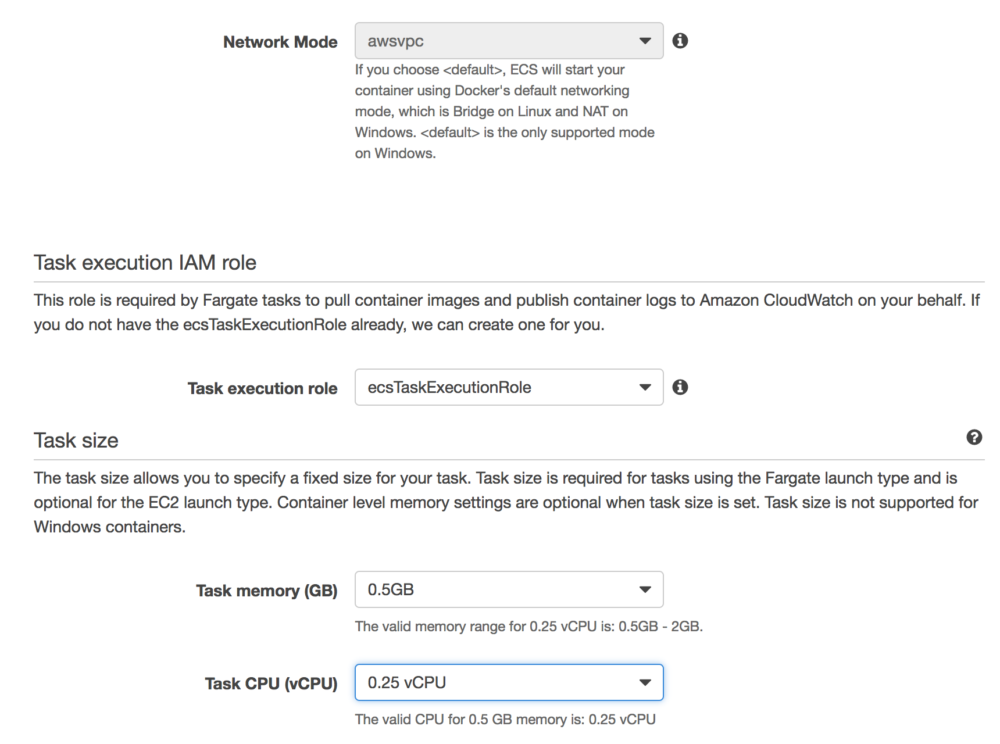

Click **Add container** to associate the iridium container with the task.

Enter values for the following fields:

* **Container name** - this is a logical identifier, not the name of the container image (e.g. `interstella-iridium`).
* **Image** - this is a reference to the container image stored in ECR.  The format should be the same value you used to push the iridium container to ECR - <pre><b><i>ECR_REPOSITORY_URI</i></b>:latest</pre>
* **Memory Limits** - select **Soft limit** from the drop down, and enter `128`.
* **Port mapping** - set the container port to be `80`.

Here's an example: 

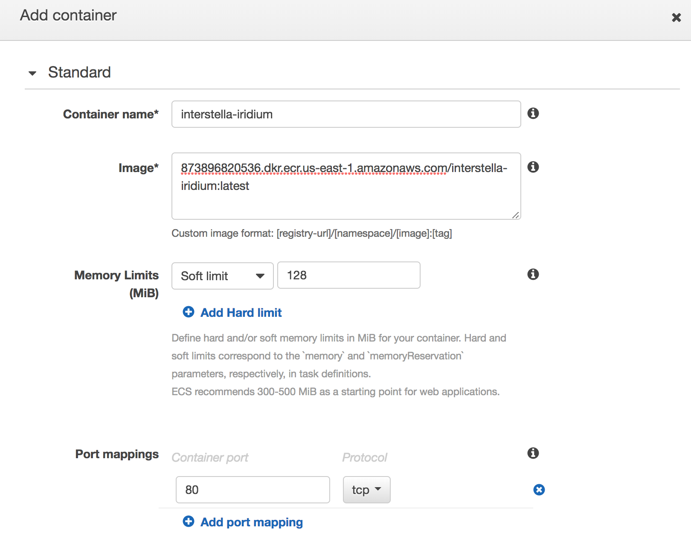

*Note: Notice you didn't have to specify the host port because Fargate uses the awsvpc network mode. Depending on the launch type (EC2 or Fargate), some task definition parameters are required and some are optional. You can learn more from our [task definition documentation](https://docs.aws.amazon.com/AmazonECS/latest/developerguide/task_definitions.html).*

The iridium app code is designed to send order fulfillment to the fulfillment service running on the monolith.  It references an environment variable called "monolithUrl" to know where to send fulfillment.

Scroll down to the "Advanced container configuration" section, and in the "Environment" section, create an environment variable using `monolithUrl` for the key. For the value, enter the **ALB DNS name** that currently front-ends the monolith.  This is the same DNS name you used in lab 3 to subscribe to the Orders topic.

Here's an example:

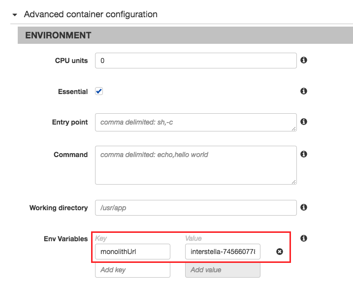

Fargate conveniently enables logging to CloudWatch for you.  Keep the default log settings and take note of the **awslogs-group** and the **awslogs-stream-prefix**, so you can find the logs for this task later.

Here's an example:

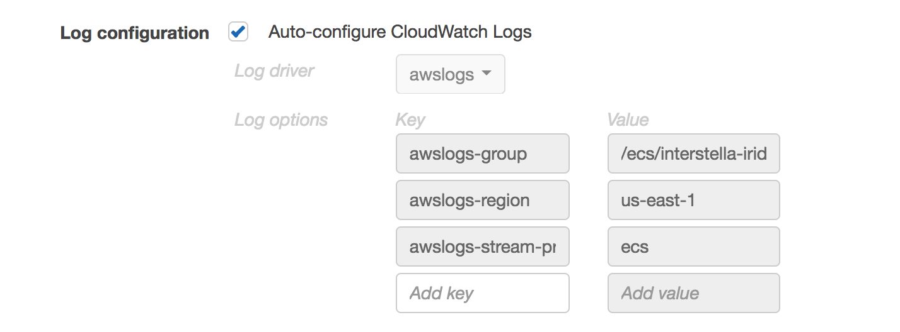

Click **Add** to associate the container definition, and click **Create** to create the task definition.

5\. Create an ECS service to run the iridium task definition you just created and associate it with the existing interstella ALB to start accepting orders from the iridium SNS topic.

You should still be on the screen showing the new revision of the iridium task definition you just created.  Under the **Actions** drop down, choose **Create Service**.

Configure the following fields:

* **Launch type** - select **Fargate**
* **Cluster** - select your workshop ECS cluster
* **Service name** - enter a name for the service (e.g. `interstella-iridium`)
* **Number of tasks** - enter `1`.

Here's an example:

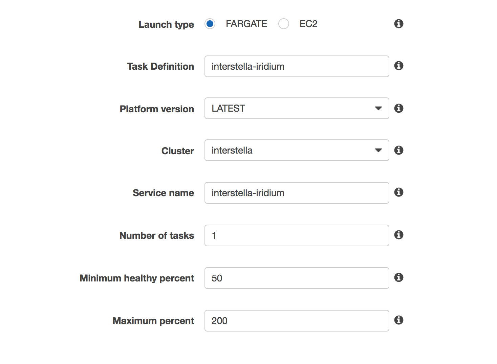

Leave other settings as defaults and click **Next Step**

Since the task definition uses awsvpc network mode, you can choose which VPC and subnet(s) to host your tasks.

For **Cluster VPC**, select your workshop VPC.  And for **Subnets**, select the public subnets; you can identify these based on the tags.

Leave the default security group which allows inbound port 80.  If you had your own security groups defined in the VPC, you could assign them here.

Here's an example:

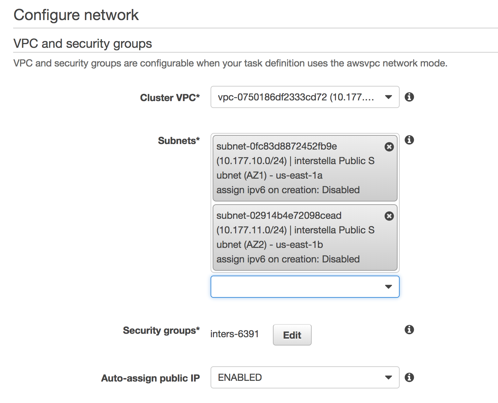

Scroll down to "Load balancing" and select **Application Load Balancer** for *Load balancer type*.

You'll see a **Load balancer name** drop-down menu appear.  Select the same Interstella ALB used for the monolith ECS service.

In the "Container to load balance" section, select the **Container name : port** combo from the drop-down menu that corresponds to the iridium task definition.

Your progress should look similar to this:

Click **Add to load balancer** to reveal more settings.

For the **Listener Port**, select **80:HTTP** from the drop-down.

For the **Target Group Name**, you'll need to create a new group for the iridium containers, so leave it as "create new" and replace the auto-generated value with `interstella-iridium`.  This is a friendly name to identify the target group, so any value that relates to the iridium microservice will do.

Change the path pattern to `/iridium*`.  The ALB uses this path to route traffic to the iridium target group.  This is how multiple services are being served from the same ALB listener.  Note the existing default path routes to the monolith target group.

For **Evaluation order** enter `1`.  Edit the **Health check path** to be `/iridium/`.  You need the trailing forward slash for health checks to be successful.

And finally, uncheck **Enable service discovery integration**.  While public namespaces are supported, a public zone needs to be configured in Route53 first.  Consider this convenient feature for your own services, and you can read more about [service discovery](https://docs.aws.amazon.com/AmazonECS/latest/developerguide/service-discovery.html) in our documentation.

Your configuration should look similar to this:

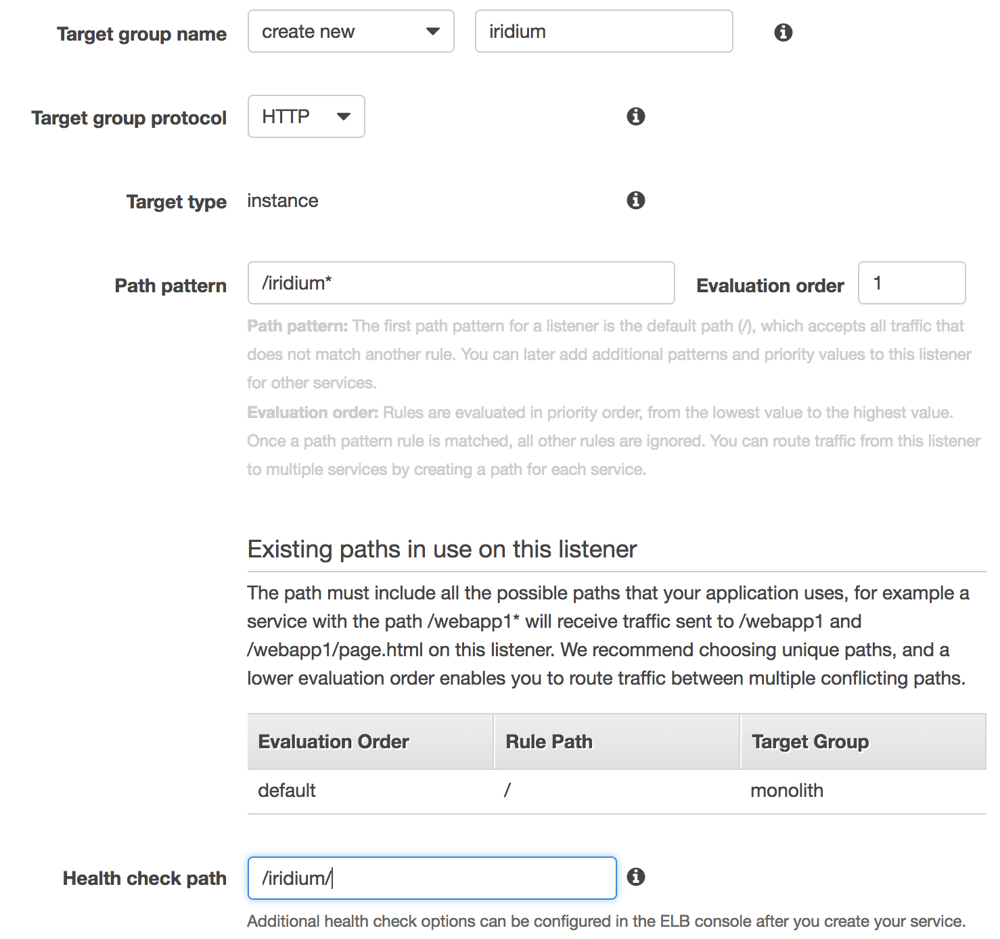

*Note: It's worth noting that the microservice application(s) are designed to listen on the path /resource/, which mirrors the path-based routing configuration of the ALB.  The ALB will pass the URL request as is to the targets, and "/iridium/" is the path that the iridium microservice is expecting, for example.*

Leave the other fields as defaults and click **Next Step**.

Skip the Auto Scaling configuration by clicking **Next Step**.

Click **Create Service** on the Review page.

Once the Service is created, click **View Service** and you'll see your task definition has been deployed as a service.  It starts out in the **PROVISIONING** state, progresses to the **PENDING** state, and if your configuration is successful, the service will finally enter the **RUNNING** state.  You can see these state changes by periodically click on the refresh button.

7\. Test processing iridium orders by subscribing the ALB endpoint with iridium path to the iridium SNS topic.

Subscribe the ALB endpoint to the SNS order topic using the [API Key Management Portal](https://www.interstella.trade/getkey.html) to start receiving orders from Interstella HQ and test your service.

You should already have your ALB public DNS name noted down, but if not, go to the [EC2 dashboard](https://console.aws.amazon.com/ec2/v2/home), click on **Load Balancers** under the **Load balancing** section of the left menu.  Select the ALB you created and look for the **DNS Name** listed in the Description tab.

Open the [API Key Management Portal](http://www.interstella.trade/getkey.html) in a new tab.  If you're not already logged in, you'll need to login with the username and password you created during the Workshop Setup.

Enter the ALB endpoint in the SNS Subscription text field using the following format, only this time use the path `/iridium/`:

<pre>
http://<b><i>ALB_ENDPOINT_DNS_NAME</i></b>/iridium/
</pre>

Click on **Subscribe to Iridium topic** to subscribe to the Iridium SNS topic.  You'll see a pop-up saying "pending confirmation" confirming the subscription has been submitted.

Navigate to the CloudWatch Logs dashboard and review the latest log stream for the iridium log group.  You should see logs corresponding to orders being processed along with GET requests in your log stream which are ALB health checks.

8\. Now that the iridium microservice is running, it's time to remove the functionality from the monolith code.

Go back to your Cloud9 environment where you built the monolith and iridium container images.

In the monolith folder, open monolith.py in the Cloud9 editor and find the line that reads:

<pre>
iridiumResult = iridium()
</pre>

It should be line 81, in the app route decorator for the /order/ path.  Once you find that line, comment it out like so:

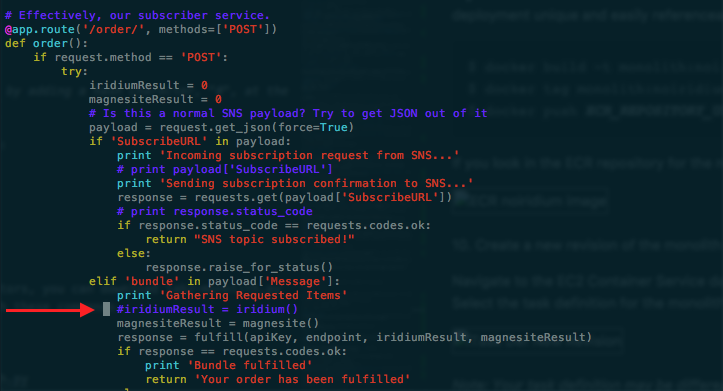

*Tip: if you're not familiar with Python, you can comment out a line by adding a hash character, "#", at the beginning of the line.*

What you've done is remove iridium processing from within the monolith.  Instead the iridium microservice is handling that and fulfilling back through the monolith using the glueFulfill() integration hook.

Save your changes and close the file.

9\. Build, tag and push the monolith image to the monolith ECR repository.

Use the tag `noiridium` instead of "latest".  This is a best practice because it makes the specific deployment unique and easily referenceable.

<pre>
$ docker build -t monolith:noiridium .
$ docker tag monolith:noiridium <b><i>ECR_REPOSITORY_URI</i></b>:noiridium
$ docker push <b><i>ECR_REPOSITORY_URI</i></b>:noiridium
</pre>

If you look at the monolith repository in ECR, you'll see the pushed image tagged as "noiridium".

10\. Create a new revision of the monolith task definition using the new monolith container image tagged as noiridium.

Navigate to [Task Definitions](https://console.aws.amazon.com/ecs/home#/taskDefinitions) in the ECS dashboard.  Select the latest task definition for the monolith and click **Create new revision**.

In the "Container Definitions" section, click on the container name to edit the container image associated with the task definition.

Modify the image tag from "latest" to `noiridium`.

*Note: Your ECR repository URI will be unique*

Click **Update**, and click **Create**.

11\. Update the monolith service to use the new task definition you just created.

Navigate to [Clusters](https://console.aws.amazon.com/ecs/home#/clusters) in the ECS dashboard, and click on your workshop cluster.  You should see the monolith service running in the **Services** tab.  Select the monolith service and click **Update**.

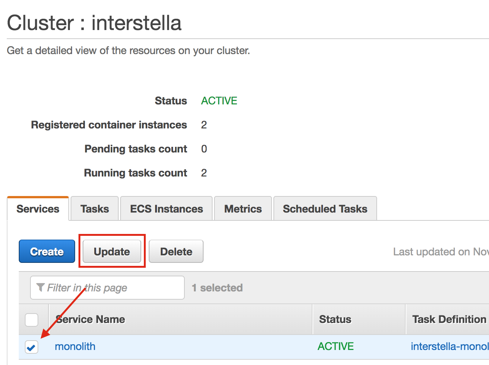

Change the **Task Definition** to be the newest version you just created.  If your earlier task definition was "interstella-monolith:1" for example, you should see a "interstella-monolith:2" in the drop-down menu.  If you're unsure, you can always go back to [Task Definitions](https://console.aws.amazon.com/ecs/home#/taskDefinitions) to check.

Click **Next step** for this step and remaining steps without making any additional modifications.  Click **Update Service** to deploy your new monolith container.  Click on **View Service** and then on the **Tasks** tab.  You should see ECS launching a new task based on the new version of the task definition, begin to drain the old task version, and eventually stop the old version.

### Checkpoint:
Congratulations, you've successfully rolled out the iridium microservice from the monolith.  If you have time, try repeating this lab to break out the magnesite microservice.  Otherwise, please remember to follow the steps below in the **Workshop Cleanup** to make sure all assets created during the workshop are removed so you do not see unexpected charges after today.

* * *

## Finished! Please fill out evaluation cards!

Congratulations on completing the labs, or at least giving it a good go.  Thanks for helping Interstella GTC regain it's glory in the universe!  If you ran out of time, do not worry, we'll leave the shared services running in the admin account.  You can always refer to http://interstella.trade/ for any updates, like if we need to halt the shared services for maintenance/updates.  We are also working on automating the admin side of the workshop, so you will be able to run this lab at your own pace at home, at work, at local meetups, on vacation...ok, maybe that last one is taking it a bit far.  If you're interested in getting updates, please complete the feedback forms and let us know.  Also, please share any constructive feedback, good or bad, so we can improve the experience for customers like yourselves.  You can reach us at <aws-interstella-team@amazon.com>

* * *

## Workshop Cleanup

This is really important because if you leave stuff running in your account, it will continue to generate charges.  Certain things were created by CloudFormation and certain things were created manually throughout the workshop.  Follow the steps below to make sure you clean up properly.

Delete manually created resources throughout the labs:

* ECS service(s) - first update the desired task count to be 0.  Then delete the ECS service itself.
* ECR - delete any Docker images pushed to your ECR repository.
* CloudWatch logs groups
* ALBs and associated target groups

Finally, [delete the CloudFormation stack](http://docs.aws.amazon.com/AWSCloudFormation/latest/UserGuide/cfn-console-delete-stack.html) launched at the beginning of the workshop to clean up the rest.  If the stack deletion process encountered errors, look at the Events tab in the CloudFormation dashboard, and you'll see what steps failed.  It might just be a case where you need to clean up a manually created asset that is tied to a resource goverened by CloudFormation.

[*^ back to the top*](#interstella-gtc-monolith-to-microservices-with-containers)
