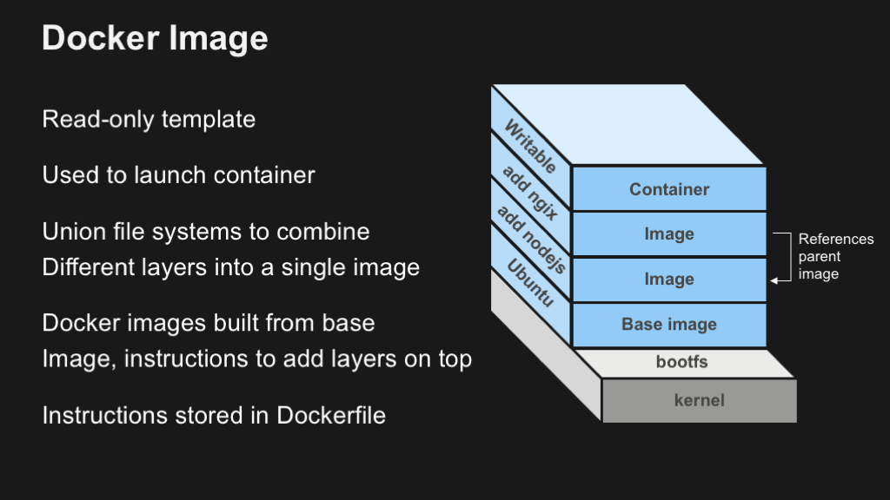
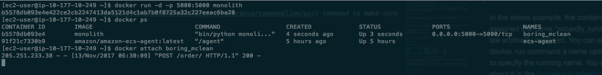
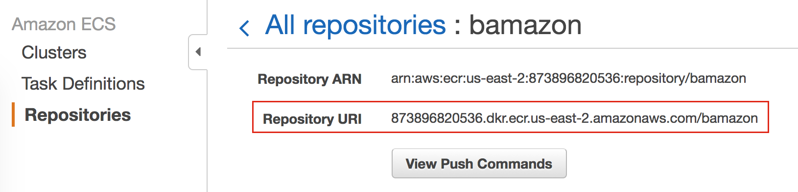
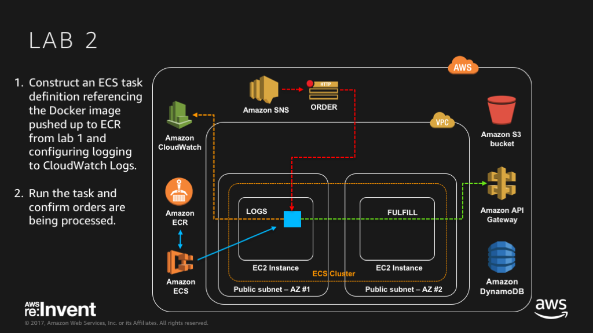
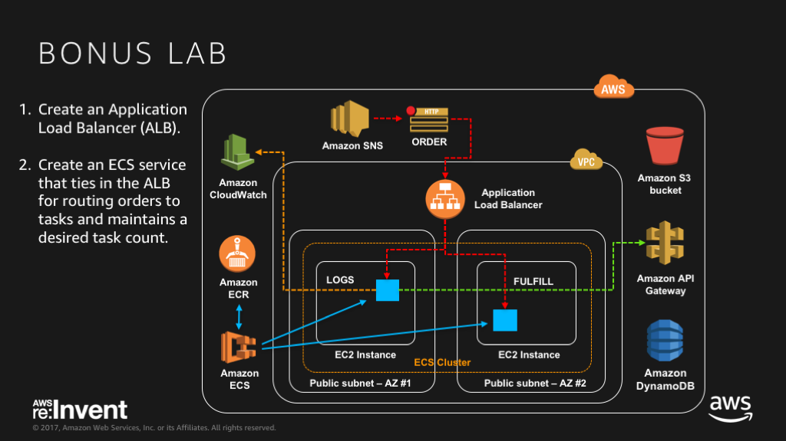
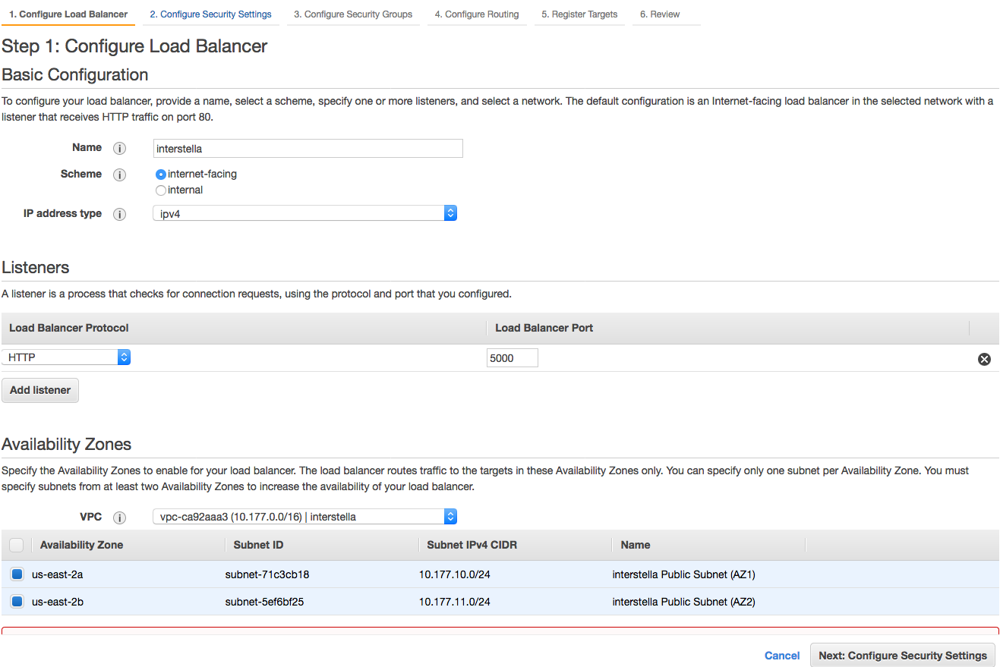
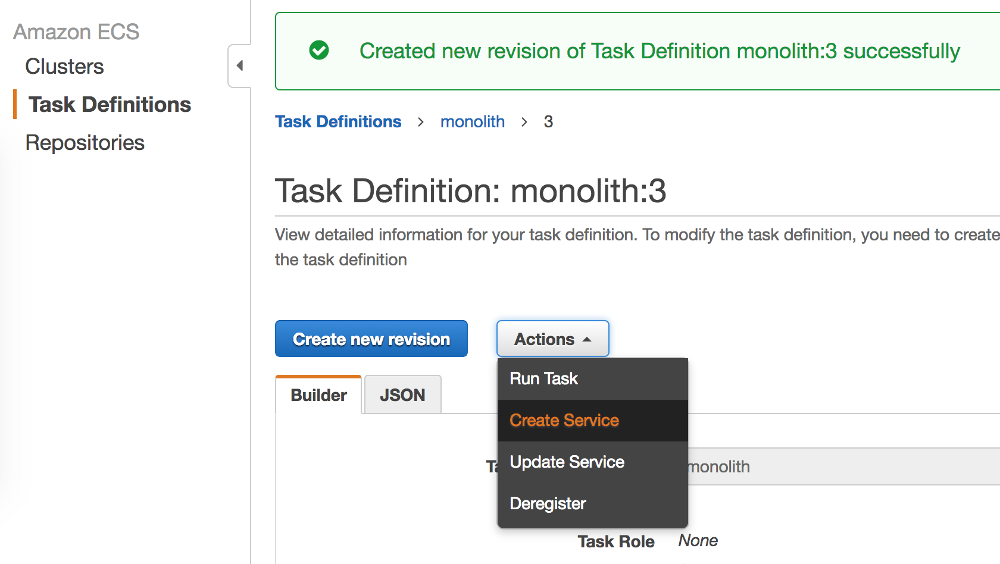
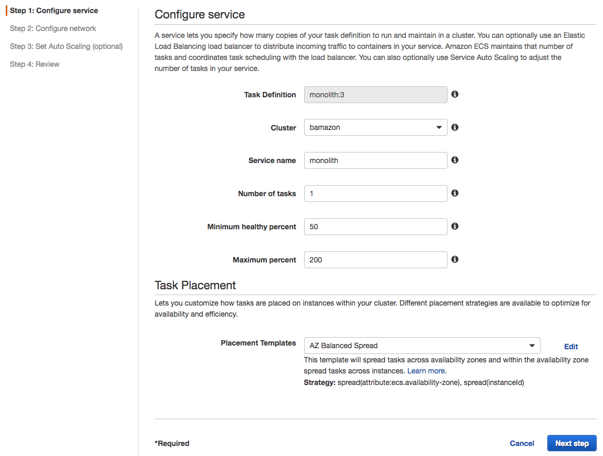
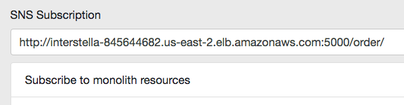

# Interstella 8888: Learn How to Use Docker on AWS

## Overview:
Welcome to the Interstella 8888 team!  Interstella 8888 is an intergalactic trading company that deals in rare resources.  Business is booming, but we're struggling to keep up with orders mainly due to our legacy logistics platform.  We heard about the benefits of containers and very much want to head in that direction.  Can you help us get there? 

If you are not familiar with containers, think of it as a way to package and run software (e.g. web server, proxy, database) in isolation alongside other containers on a server.  You might be thinking, wait, isn't that a virtual machine (VM)?  Containers do not contain the full OS stack like a VM.  Instead, a container is a portable unit of work that includes everything it needs to run as its own process - e.g. execuable, dependencies.  To learn more - [What is a Container?](https://www.docker.com/what-container).  Containers provide isolation, portability and repeatability, so your developers can easily spin up an environment and start building without the heavy lifting.  It is also important to point out that the container running on the developer's machine can also run in production as is.  

This workshop will walk you through creating and deploying containers using the standard Docker APIs to get you familar with that process.  Once you're comfortable with that, you'll learn how to take your newly minted container image and deploy it to scalable infrastructure using [Amazon EC2 Container Service](https://aws.amazon.com/ecs/) (ECS).

The software that you'll be containerizing is Interstella's legacy logistics platform, which accepts orders via Amazon Simple Notification Service (SNS).  Once containerized, we'll be able to quickly deploy changes quicker to production.  ECS is also integrated with AWS Elastic Load Balancing (ELB), so if you have time, you'll also tie in an Application Load Balancer (ALB) and use the ECS Service scheduler to run the platform as a long-running application and maintain set resources.  If you are feeling ambitious, see if you can implement task auto scaling into the mix.  Good luck and thank you for helping out Interstella 8888!

### Requirements:  
* AWS account - if you don't have one, it's easy and free to [create one](https://aws.amazon.com/)
* AWS IAM account with elevated privileges allowing you to interact with CloudFormation, IAM, EC2, ECS, ECR, ELB/ALB, VPC, SNS, CloudWatch
* A workstation or laptop with an ssh client installed, such as [putty](http://www.putty.org/) on Windows; or terminal or iterm on Mac
* Familiarity with Python, vim/emacs/nano, [Docker](https://www.docker.com/), and AWS - not required but a bonus

### Labs:  
These labs are designed to be completed in sequence, and the full set of instructions are documented below.  Read and follow along to complete the labs.  If you're at a live AWS event, the workshop attendants will give you a high level run down of the labs and be around to answer any questions.  Don't worry if you get stuck, we provide hints along the way.  

* **Workshop Setup:** Setup working environment on AWS  
* **Lab 1:** Containerize the Interstella logistics software
* **Lab 2:** Deploy containers using Amazon ECR and Amazon ECS
* **Bonus Lab:** Scale the logistics platform with an ALB 

### Conventions:  
Throughout this workshop, we provide commands for you to run in the terminal.  These commands will look like this: 

<pre>
$ ssh -i <b><i>PRIVATE_KEY.PEM</i></b> ec2-user@<b><i>EC2_PUBLIC_DNS_NAME</i></b>
</pre>

The command starts after the $.  Text that is ***UPPER_ITALIC_BOLD*** indicates a value that is unique to your environment.  For example, the ***PRIVATE\_KEY.PEM*** refers to the private key of an SSH key pair that you've created, and the ***EC2\_PUBLIC\_DNS\_NAME*** is a value that is specific to an EC2 instance launched in your account.  You can find these unique values either in the CloudFormation outputs or by going to the specific service dashboard in the AWS management console.

Hints are provided along the way and will look like:

HINT

Sweet, you just revealed a hint!

Click on the arrow to show the contents of the hint.  

### Workshop Cleanup:
You will be deploying infrastructure on AWS which will have an associated cost.  Fortunately, this workshop should take no more than 2 hours to complete, so costs will be minimal.  If you're attending an AWS event, credits will be provided.

**IMPORTANT:**

When you're done with the workshop, follow the steps at the very end of the instructions to make sure everything is cleaned up.

* * * 

## Let's Begin!  
  
### Workshop Setup:

1\. Log into the AWS Management Console and select an [AWS region](http://docs.aws.amazon.com/AWSEC2/latest/UserGuide/using-regions-availability-zones.html).  The region dropdown is in the upper right hand corner of the console to the left of the Support dropdown menu.  For this workshop, choose either **Ohio** or **Oregon** or **Ireland**.  Workshop administrators will typically indicate which region you should use.

2\. Create an [SSH key pair](http://docs.aws.amazon.com/AWSEC2/latest/UserGuide/ec2-key-pairs.html) that will be used to login to launched EC2 instances.  If you already have an SSH key pair and have the PEM file (or PPK in the case of Windows Putty users), you can skip to the next step.  

Go to the EC2 Dashboard and click on **Key Pairs** in the left menu under Network & Security.  Click **Create Key Pair**, provide a name (e.g. interstella-workshop), and click **Create**.  Download the created .pem file, which is your private SSH key.      

*Mac or Linux Users*:  Change the permissions of the .pem file to be less open using this command:

<pre>$ chmod 400 <b><i>PRIVATE_KEY.PEM</i></b></pre>

*Windows Users*: Convert the .pem file to .ppk format to use with Putty.  Here is a link to instructions for the file conversion - [Connecting to Your Linux Instance from Windows Using PuTTY](http://docs.aws.amazon.com/AWSEC2/latest/UserGuide/putty.html)

3\. Generate a Fulfillment API Key for the logistics software [here](http://www.interstella.trade/getkey.html).  Create a username and password to login to the API Key Management portal; you'll need to access this page again later in the workshop, so don't forget what they are.  Click **GetKey** to generate an API Key.  Note down your username and API Key because we'll be tracking resource fulfillment rates.  The API key will be used later to authorize the logistics software send messages to the order fulfillment API endpoint (see arch diagram in Lab 1).

4\. For your convenience, we provide a [CloudFormation](http://docs.aws.amazon.com/AWSCloudFormation/latest/UserGuide/Welcome.html) template to stand up core workshop infrastructure.

Here is what the workshop environment looks like:

The CloudFormation template will launch the following:
* VPC with public subnets, routes and Internet Gateway
* EC2 Instances with security groups (inbound tcp 22, 80, 5000) and joined to an ECS cluster 
* ECR repositories for your container image
* Parameter store to hold values for API Key, fulfillment API endpoint, and SNS Orders topic

*Note: SNS Orders topic, S3 assets, API Gateway and DynamoDB tables are admin components that run in the workshop administrator's account.  If you're at a live AWS event, this will be provided by the workshop facilitators.  We're working on packaging up the admin components in an admin CloudFormation template, so you can run this workshop at your office, home, etc.*

Click on the CloudFormation launch template link below for the region you selected in Step 1.  The link will load the CloudFormation Dashboard and start the stack creation process in the specified region.

Region | Launch Template
------------ | -------------  
**Ohio** (us-east-2) | [Launch Interstella CloudFormation Stack in Ohio](https://console.aws.amazon.com/cloudformation/home?region=us-east-2#/stacks/new?stackName=Interstella-workshop&templateURL=https://s3-us-west-2.amazonaws.com/www.interstella.trade/workshop1/starthere.yaml)  
**Oregon** (us-west-2) | [Launch Interstella CloudFormation Stack in Oregon](https://console.aws.amazon.com/cloudformation/home?region=us-west-2#/stacks/new?stackName=Interstella-workshop&templateURL=https://s3-us-west-2.amazonaws.com/www.interstella.trade/workshop1/starthere.yaml) 
**Ireland** (eu-west-1) | [Launch Interstella CloudFormation Stack in Ireland](https://console.aws.amazon.com/cloudformation/home?region=eu-west-1#/stacks/new?stackName=Interstella-workshop&templateURL=https://s3-us-west-2.amazonaws.com/www.interstella.trade/workshop1/starthere.yaml) 

You should be on the Select Template page, notice an S3 URL link to the CloudFormation template is already populated.  Click **Next** to continue without modifying any fields on this page.    

5\. On the Specify Details step of the Create Stack process, enter values for the following fields:

* **EnvironmentName** - this field is to used to tag resources created by CloudFormation. 

IMPORTANT NOTE: for this workshop, please use only lowercase letters because the ECR repository leverages this CloudFormation parameter and ECR repository names can only contain lower case letters.  Working on fixing this.  

* **KeyPairName** - select the key pair that you created from Step 1
* **InterstellaApiKey** - enter the API key generated from Step 3
* **InterstellaApiEndpoint** - replace this default value if the workshop admins provide you a different fulfillment API endpoint (in the form of a URL) to use
* **InterstellaOrdersTopicArn** - replace this default value, if the workshop admins provide you an SNS orders topic (in the form of an ARN) to use

All other fields can be left as their default values.  

Click **Next** to move on to the Options page.  

6\. No changes or inputs are required on the Options page.  Click **Next** to move on to the Review page.

7\. On the Review page, scroll down to the Capabilities section and click on the checkbox next to *"I acknowledge that AWS CloudFormation might create IAM resources with custom names."*.  If you do not check this box, the stack creation will fail.

Click **Create** to launch the CloudFormation stack. 

### Checkpoint:  
The CloudFormation stack will take a few minutes to launch.  Periodically check on the stack creation process in the CloudFormation Dashboard.  Your stack should show status **CREATE\_COMPLETE** in roughly 5-10 minutes.  If you select box next to your stack and click on the **Events** tab, you can see what steps it's on.  

If there was an [error](http://docs.aws.amazon.com/AWSCloudFormation/latest/UserGuide/troubleshooting.html#troubleshooting-errors) during the stack creation process, CloudFormation will rollback and terminate.  You can investigate and troubleshoot by looking in the Events tab.  Any errors encountered during stack creation will appear in the event stream as a failure.

* * * 

### Lab 1 - Containerize Interstella's logistics platform:    

In this lab, you will containerize Interstella's logistics platform, which we'll also refer to as the monolith application.  To do this, you will create a [Dockerfile](https://docs.docker.com/engine/reference/builder/), which is essentially a recipe for Docker to build a container image.  The EC2 instances provisioned by CloudFormation have Docker running on them, so you can use either one to author the Dockerfile, build the container image, and run it to confirm it's able to process orders.   

Here is a reference architecture for what you will be implementing in Lab 1:

*Reminder: You'll see SNS topics, S3 bucket, API Gateway and DynamoDB in the diagram.  These are provided by Interstella HQ for communicating orders and fulfilling orders.  They're in the diagram to show you the big picture as to how orders come in to the logistics platform and how orders get fulfilled*

*If you are attending a live AWS event, these assets will be provided.  We're working on packaging up the admin components, so you can run this workshop at your office, home, etc.*

1\. SSH into one of the launched EC2 instances to get started.  

Go to the EC2 Dashboard in the Management Console and click on **Instances** in the left menu.  Select either one of the EC2 instances created by the CloudFormation stack and SSH into the instance.  

*Tip: If your instances list is cluttered with other instances, type the **EnvironmentName** you used when running your CloudFormation template into the filter search bar to reveal only those instances.*  

<pre>
$ ssh -i <b><i>PRIVATE_KEY.PEM</i></b> ec2-user@<b><i>EC2_PUBLIC_IP_ADDRESS</i></b>
</pre>

If you see something similar to the following message (host IP address and fingerprint will be different, this is just an example) when trying to initiate an SSH connection, this is normal when trying to SSH to a server for the first time.  The SSH client just does not recognize the host and is asking for confirmation.  Just type **yes** and hit **enter** to continue:

<pre>
The authenticity of host '52.15.243.19 (52.15.243.19)' can't be established.
RSA key fingerprint is 02:f9:74:ef:d8:5c:19:b3:27:37:57:4f:da:37:2b:e8.
Are you sure you want to continue connecting (yes/no)? 
</pre>

2\. Once logged onto the instance, download the logistics application source, requirements file, and a draft Dockerfile from Interstella's S3 static site.  

Note: the flag for the curl command below is a capital O, not a zero.   

<pre>
$ curl -O http://www.interstella.trade/workshop1/code/monolith.py
$ curl -O http://www.interstella.trade/workshop1/code/requirements.txt
$ curl -O http://www.interstella.trade/workshop1/code/Dockerfile.draft
</pre>

One of Interstella's developers started working on a Dockerfile in her free time, but she was pulled to a high priority project to implement source control.  Looking at Dockerfile.draft, it looks like it's almost done, we just need a few more lines added.

*Note: You're probably wondering why the files are not in source control, and that's a great point!  Interstella is rolling out source control and has a future goal of implementing an automated CI/CD environment.  After containerizing the logistics platform, we hope you'll join us again for the next workshop where you'll help us break the monolith into microservices.  That'll build a really strong case for CI/CD code pipelines that are triggered by code checkin, run integration tests, and produce fresh container images to be deployed to production.  Who knows, we might even automate deployments too!  For now, baby steps, let's get the monolith containerized so we can scale faster to at least keep up with orders.  We'd love to have you back for the next two workshops in the series to work on microservices and CI/CD projects, respectively.*   

3\. Use your favorite text editor (vi, nano, emacs are installed) on the instance to open Dockerfile.draft.  

*Note: If you'd like to install another editor, feel free to do so using [yum](http://docs.aws.amazon.com/AWSEC2/latest/UserGuide/install-software.html).*

Review the contents, and you'll see a few comments at the end of the file noting what still needs to be done.  Comments are denoted by a "#".  Docker builds container images by stepping through the instructions listed in the Dockerfile.  Docker is built on this idea of layers starting with a base and executing each instruction that introduces change as a new layer.  It caches each layer, so as you develop and rebuild the image, Docker will reuse layers (often referred to as intermediate layers) from cache if no modifications were made.  Once it reaches the layer where edits are introduced, it will build a new intermediate layer and associate it with this particular build.  This makes tasks like image rebuild very efficient and you can maintain multiple build versions. 

In our case, the first line - "FROM ubuntu:14.04" - specifies a base image as a starting point.  The next instruction - "RUN apt-get -y update" - creates a new layer where Docker updates package lists from the Ubuntu repositories.  This continues until you reach the last instruction which in most cases is some sort of ENTRYPOINT or executable being run.    

Also, after you've built your image, you'll want to store it in an image repository like [EC2 Container Registry (ECR)](https://aws.amazon.com/ecr/) or [DockerHub](https://hub.docker.com/) for persistence and version control.  Docker tracks each intermediate layer for changes and only pushes those that have changed, which is super efficient.

Add the remaining instructions to Dockerfile.draft.  Here are links to documentation and hints to help along the way: 

*#[TODO]: Copy monolith.py and requirements file into container image*

* https://docs.docker.com/engine/reference/builder/#copy

*#[TODO]: Install dependencies listed in the requirements.txt file using pip*

* https://pip.pypa.io/en/stable/user_guide/#requirements-files

*#[TODO]: Specify a listening port for the container*

* https://docs.docker.com/engine/reference/builder/#expose
* App listening port can be found in the app source - monolith.py 

*#[TODO]: Run the monolith.py as the final step. We want this container to run as an executable. Looking at ENTRYPOINT for this?*

* https://docs.docker.com/engine/reference/builder/#entrypoint
* The platform is an executable python file, so our ops team runs 'python monolith.py' to launch in production.

Once you've made your changes or if you get stuck, you can check your work by comparing your additions to this [working Dockerfile](http://www.interstella.trade/workshop1/hints/Dockerfile.hint).  If your Dockerfile looks good, rename your file from "Dockerfile.draft" to "Dockerfile" and move on to the build step.

<pre>
$ mv Dockerfile.draft Dockerfile
</pre> 

4\. Build the image using the [Docker build](https://docs.docker.com/engine/reference/commandline/build/) command.  This command needs to be run in the same directory where your Dockerfile is and note the trailing period which tells the build command to look in the current directory for the Dockerfile.

<pre>
$ docker build -t monolith .
</pre> 

You'll see a bunch of output as Docker builds all the layers to the image.  If there is a problem along the way, the build process will fail and stop.  Otherwise, you'll see a success message at the end of the build output like this:

<pre>
Step 15/15 : ENTRYPOINT bin/python monolith.py
---> Running in 188e00e5c1af
---> 7f51e5d00cee
Removing intermediate container 188e00e5c1af
Successfully built 7f51e5d00cee
</pre>

*Note: Your output will not be exactly like this, but it will be similar.*

The working Dockerfile that you used as a reference is a good starting point especially since it successfully built, but it can be improved.  As noted above, the next big project for Interstella is to break apart the monolith codebase into microservices, which means developers will likely be editing the source code of monolith.py often and rebuilding this image.

Edit monolith.py by adding an arbitrary comment somewhere in the file.  If you're not familiar with Python, [comments](https://docs.python.org/2/tutorial/introduction.html) start with the hash character, '#' and are essentially ignored when the code is interpreted.  

For example, here a comment ('# Author: Mr Bean') was added before importing the time module:
<pre>
# Author: Mr Bean

import time
from flask import Flask
from flask import request
import json
import requests
....
</pre>

Rebuild the image using the 'docker build' command from above and notice Docker references layers from cache, and starts rebuilding layers from Step 11, when monolith.py is copied over: 

<pre>
Step 8/15 : RUN virtualenv ${PRODUCT}
 ---> Using cache
 ---> f53443a081bf
Step 9/15 : WORKDIR ${PRODUCT}
 ---> Using cache
 ---> 8ed7d4c92e24
Step 10/15 : RUN bin/pip install --upgrade pip &&     bin/pip install requests[security]
 ---> Using cache
 ---> 68cf52215eb7
Step 11/15 : COPY ./monolith.py .
 ---> 313b28d629bb
Removing intermediate container 3b9db00c476d
Step 12/15 : COPY ./requirements.txt .
 ---> 24aea2192c09
Removing intermediate container 88fb9b72087e
Step 13/15 : RUN bin/pip install -r requirements.txt
 ---> Running in 30794a84a399
Collecting Flask==0.12.2 (from -r requirements.txt (line 1))
</pre>

Try reordering the instructions in your Dockerfile to copy the monolith code over after the requirements are installed.  The thinking here is that monolith.py will see more changes than the dependencies noted in requirements.txt, so why rebuild requirements every time when we can just have it be another cached layer.      

Here's another [working Dockerfile](http://www.interstella.trade/workshop1/hints/Dockerfile.anotherhint) as a hint.

If you want to see the improvement in build time, you'll need to:

* rebuild the Docker image with the new Dockerfile
* introduce a change in monolith.py, such as adding another arbitrary comment to monolith.py
* rebuild the Docker image again and notice dependencies are referenced from cache:

<pre>
Step 11/15 : COPY ./requirements.txt .
 ---> Using cache
 ---> 448f69a6bf1b
Step 12/15 : RUN bin/pip install -r requirements.txt
 ---> Using cache
 ---> ff783b9e3fda
Step 13/15 : COPY ./monolith.py .
 ---> f5583e78794b
Removing intermediate container a4ace03b75dd
Step 14/15 : EXPOSE 5000
</pre>

By this point you should have a Docker image built.  

The -t flag names the resulting container image.  List your docker images to see the image you have built.

<pre>
$ docker images
</pre>

Here's a sample output, note the monolith image in the list: 

<pre>
[ec2-user@ip-10-177-10-249 ~]$ docker images
REPOSITORY               TAG        IMAGE ID        CREATED             SIZE
monolith                 latest     87d3de20e191    17 seconds ago      532 MB
&lt;none&gt;                   &lt;none&gt;     850d78c7aa5f    27 minutes ago      735 MB
golang                   1.9        1a34fad76b34    8 days ago          733 MB
ubuntu                   14.04      3aa18c7568fc    8 days ago          188 MB
amazon/amazon-ecs-agent  latest     96e5393c89d4    6 weeks ago         25.4 MB
</pre>

*Note: Your output will not be exactly like this, but it will be similar.*

Notice the image is also tagged as "latest".  This is the default behavior if you do not specify a tag of your own, but you can use this as a freeform way to identify an image, e.g. monolith:1.2 or monolith:experimental.  This is very convenient for identifying your images as they correspond with branches of code as well.

5\. Run the docker container to make sure it is working as expected.  Interstella's logistics platform will automatically subscribe to the SNS orders feed and is configured to send fulfillment to the order fulfillment API.  When you issue the [docker run](https://docs.docker.com/engine/reference/run/) command, the -p flag is used to map the host listening port to the container listening port.  

<pre>
$ docker run -p 5000:5000 monolith
</pre>

Here's a sample output:

<pre>
[ec2-user@ip-10-177-10-137 ~]$ docker run -p 5000:5000 monolith
INFO:botocore.vendored.requests.packages.urllib3.connectionpool:Starting new HTTP connection (1): 169.254.169.254
INFO:botocore.vendored.requests.packages.urllib3.connectionpool:Starting new HTTP connection (1): 169.254.169.254
INFO:botocore.vendored.requests.packages.urllib3.connectionpool:Starting new HTTPS connection (1): ssm.eu-west-1.amazonaws.com
INFO:botocore.vendored.requests.packages.urllib3.connectionpool:Starting new HTTPS connection (1): sns.us-west-2.amazonaws.com
INFO:werkzeug: * Running on http://0.0.0.0:5000/ (Press CTRL+C to quit)
INFO:werkzeug: * Restarting with stat
INFO:botocore.vendored.requests.packages.urllib3.connectionpool:Starting new HTTP connection (1): 169.254.169.254
INFO:botocore.vendored.requests.packages.urllib3.connectionpool:Starting new HTTP connection (1): 169.254.169.254
INFO:botocore.vendored.requests.packages.urllib3.connectionpool:Starting new HTTPS connection (1): ssm.eu-west-1.amazonaws.com
INFO:botocore.vendored.requests.packages.urllib3.connectionpool:Starting new HTTPS connection (1): sns.us-west-2.amazonaws.com
WARNING:werkzeug: * Debugger is active!
INFO:werkzeug: * Debugger PIN: 150-079-776
Incoming subscription request from SNS...
Sending subscription confirmation to SNS...
INFO:werkzeug:205.251.234.35 - - [27/Nov/2017 18:10:48] "POST /order/ HTTP/1.1" 200 -
Incoming subscription request from SNS...
Sending subscription confirmation to SNS...
INFO:werkzeug:54.240.230.190 - - [27/Nov/2017 18:10:49] "POST /order/ HTTP/1.1" 200 -
Gathering Requested Items
Getting Iridium
Getting Magnesite
Trying to send a request to the API
API Status Code: 200
Bundle fulfilled
</pre>

*Note: Your output will not be exactly like this, but it will be similar.*

The container runs in the foreground with stdout/stderr printing to the screen, but much like services running on a host, you want these processes to run in the background in production.  If you want to try running the container as a background process, you could use the -d flag.

Use **Ctrl-C** to stop the container running in the foreground and try running it again, this time in the background.  

<pre>
$ docker run -d -p 5000:5000 monolith
</pre>

List running docker containers with the [docker ps](https://docs.docker.com/engine/reference/commandline/ps/) command to make sure monolith is running. 

<pre>
$ docker ps
</pre>

You should see monolith running in the list.  Let's additionally confirm that orders are being processed by attaching stdin/stdout/stderr to the container with the [docker attach](https://docs.docker.com/engine/reference/commandline/attach/) command.  The attach command expects a container name, and you can find the running name of your container from the output of the 'docker ps' command (last column on the right).  If the container is running as expected, you should see HTTP POST entries being written to stdout.  

<pre>
$ docker attach <b><i>CONTAINER_NAME</i></b>
</pre>

Here's sample output from these commands: 

 

In the sample output, the container was assigned the name "boring_mclean".  Names are arbitrarily assigned.  You can also pass the docker run command a name option if you want to specify the running name.  You can read more about it in the [Docker run reference](https://docs.docker.com/engine/reference/run/).  For now, kill the container using **Ctrl-C** now that we know it's working properly.

6\. Now that you have a deployable container, tag and push the image to ECR.  Not only does this allow for version control and persistence, but ECS will reference the image from ECR in the next lab to deploy it.  

In the AWS Management Console, navigate to the EC2 Container Service dashboard and click on **Repositories** in the left menu.  You should see the repository created by CloudFormation named the EnvironmentName (in the example below, I used 'bamazon' as my EnvironmentName) specified during stack creation.  

Click on the repository name, and note the Repository URI:

*Note: Your repository URI will be unique.*

Tag and push your container image to the repository.

<pre>
$ docker tag monolith:latest <b><i>ECR_REPOSITORY_URI</i></b>:latest
$ docker push <b><i>ECR_REPOSITORY_URI</i></b>:latest
</pre>

When you issue the push command, Docker pushes the layers up to ECR, and if you refresh the monolith repository page, you'll see an image indicating the latest version.  

*Note: that you did not need to authenticate docker with ECR because the [Amazon ECR Credential Helper](https://github.com/awslabs/amazon-ecr-credential-helper) has been installed and configured for you on the EC2 instance.  This was done as a bootstrap action when launching the EC2 instances.  Review the CloudFormation template and you will see where this is done.  You can read more about the credentials helper in this blog article - https://aws.amazon.com/blogs/compute/authenticating-amazon-ecr-repositories-for-docker-cli-with-credential-helper/*

### Checkpoint:  
At this point you have a working container for the monolith codebase stored in an ECR repository and ready to deploy with ECS in the next lab. 

* * * 

### Lab 2 - Deploy your container using ECR/ECS:   

In this lab, you will deploy the containerized logistics software (i.e. monolith) using ECS.  Deploying individual containers is not difficult.  However, when you need to coordinate many container deployments or maybe you want to improve how you do devops or deployments, a cluster manager and scheduler like ECS can greatly simplify the task (no pun intended).  The container image you created in the last lab is stored in ECR, and since ECR and ECS are tightly integrated, deploying the container will be easy to do.  

ECS uses a JSON formatted template called a [Task Definition](http://docs.aws.amazon.com/AmazonECS/latest/developerguide/task_definitions.html) that describes one or more containers that make up your application or unit of work.  With task definitions, you can specify things like container image(s) you want to use, host:container port mappings, cpu and memory allocations, logging, and more. 

Here is a reference architecture for what you will be implementing in Lab 2:

*Note: You will use the AWS Management Console for this lab, but remember that you can programmatically accomplish the same thing using the AWS CLI or SDKs or CloudFormation.*

1\. Create an ECS task definition to deploy the container you built in the last lab.

In the AWS Management Console, navigate to the EC2 Container Service dashboard.  Click on **Task Definitions** in the left menu.  Click on **Create New Task Definition**.  

Enter a name for your Task Definition, e.g. interstella-monolith.  Leave Task Role and Network Mode as defaults. 

*Tip: The next step will reference the container image you pushed to ECR, so make sure you have the ECR repository URI for the monolith container handy.*

Click **Add container**.  Enter values for the following fields:
* **Container name** - this is a logical identifier, not the name of the container image, e.g. monolith
* **Image** - this is a reference to the container image stored in ECR.  The format should be the same value you used to push the container to ECR - <pre><b><i>ECR_REPOSITORY_URI</i></b>:latest</pre>
* **Memory Limits** - select **Soft limit** from the drop down, and enter **128**.  

*Note: This assigns a soft limit of 128MB of RAM to the container, but since it's a soft limit, it does have the ability to consume more available memory if needed.  A hard limit will kill the container if it exceeds the memory limit.  You can define both for flexible memory allocations.  Resource availability is one of the factors that influences container placement.  You can read more about [ContainerDefinitions](http://docs.aws.amazon.com/AmazonECS/latest/APIReference/API_ContainerDefinition.html) in our documentation*

* **Port mappings** - enter **5000** for both the host and container port.  

*Note: You might be wondering how you can more than one of the same container on a single host since there could be conflicts based on the port mappings configuration.  ECS offers a dynamic port mapping feature when using the ALB as a load balancer for your container service.  We'll visit this in the bonus lab when scaling the microservices with ALB*

Leave the remaining fields as is and click **Add** to associate this container with the task definition. 

Here's an example of what the container definition should look like:

 

*Note: Your container image URI will be unique.* 

Click **Create** to finish creating the task definition. 

2\. Now test the task definition by running it.  You should be at the task definition view where you can do things like create a new revision or invoke certain actions.  In the **Actions** dropdown, select **Run Task** to launch your container.  

Leave all the fields as their defaults and click **Run Task**. 

*Note: There are many options to explore in the Task Placement section of the Run Task action, and while we will not touch on every configuration in this workshop, you can read more about [Scheduling Tasks](http://docs.aws.amazon.com/AmazonECS/latest/developerguide/scheduling_tasks.html) in our documentation.*

You'll see the task start in the **PENDING** state.  

In a few seconds, click on the refresh button until the task changes to a **RUNNING** state. 

3\. In the previous lab, you attached to the running container to get stdout.  While you could do still do that, there's a better way to handle logging.  ECS offers integration with CloudWatch logs through an awslogs driver that can be enabled in the container definition. 

First, stop the task that you ran in the last step.  You can do this by selecting the checkbox next to the running task and clicking the **Stop** button.

Next, create a CloudWatch log group to serve as a logging destination. 

Navigate to the CloudWatch dashboard, and click on **Logs** in the left menu.  In the **Actions** drop down, select **Create log group** and enter a name for the group, e.g. interstella-monolith  

  

4\. Next, update the monolith container definition in the task definition you created to enable the logs driver.  

Navigate to the EC2 Container Service dashboard and click **Task Definitions** in the left menu.  Select the task definition you created earlier and click **Create new revision**.

 

Under **Container Definitions**, click on the monolith container definition you created earlier.  You'll see the Standard options that you had set.  Scroll down to **Storage and Logging** options and find the **Log configuration** section.  Select **awslogs** from the *Log driver* dropdown. For *Log options*, enter the name of the CloudWatch log group that you created in step 7 and enter the AWS region of the log group.

Click **Update** to finalize the updates to the container definition, and click **Create** to create the new revision of your task definition.  Notice your task definition's revision number incremented. 

5\. Test the new revision of the task definition.  In the **Actions** drop down menu, select **Run Task**.  Leave the defaults and click **Run Task**.  If you get stuck, refer back to steps 5-6.  

Once your task is running, navigate back to the CloudWatch Logs dashboard, and click on your log group.  As your container processes orders, you'll see a log stream appear in the log group reflecting the HTTP POST logs written to stdout you saw earlier.  

Click on the log stream to view log entries.    

### Checkpoint:  
You've created a task definition and are able to repeatedly deploy the monolith container using ECS.  You've also enabled logging to CloudWatch Logs, so you can verify your container is working as expected.  Now you're ready to tackle a bigger challenge, horizontally scaling the containerized logistics platform, so you can process more orders and as a bonus improve the fault tolerance.  Let's get to it! 

* * *

### Bonus Lab - Scale the logistics platform with ALB: 

By now you have successfully deployed Interstella's logistics software as a container.  If you ran multiple copies of the container/task, there would be more capacity, but each container currently self-registers to the SNS topic.  As a result, the same order would be processed by all running containers.  We need a load balancer to distribute the orders to a pool of containers, so orders are only processed once.  

In this lab, you will update the code to not self-register to the SNS topic.  Then you will implement an ALB to front end your containers.  ALB has a feature called dynamic port mapping for ECS containers, which allows you to run multiple copies of the same container on the same host.  The current task definition maps host port 5000 to container port 5000.  This means you would only be able to run one instance of that task on a specific host.  If the host port configuration in the task definition is set to 0, an ephemeral listening port is automatically assigned to the host and mapped to the container which still listens on 5000.  If you then tried to run two of those tasks, there wouldn't be a port conflict on the host because each task runs on it's own ephemeral port.  These hosts are grouped in a target group for the ALB to route traffic to.

What ties this all together is an ECS Service, which maintains a desired task count (i.e. n number of containers) and integrates the ALB.  You could take it even further by implementing task auto scaling, but let's set up the foundation first.  And finally, you will register the ALB endpoint with the SNS topic to start the order flow.    

Here is a reference architecture for what you will be implementing in the Bonus Lab:

1\. Disable the logistics platform from self-registering to SNS.  

SSH into the EC2 instance you used to build the container in lab 1 and open monolith.py with your favorite text editor.  Comment out the lines in the app code that subscribes to SNS.  If you're not familiar with Python, you can comment out multiple lines by surrounding the text in triple single quotes, see below:

<pre>
# Subscribe SNS
'''
snsClient = boto3.client('sns',region_name=orderTopicRegion)
ip = urlopen('http://169.254.169.254/latest/meta-data/public-ipv4').read().decode('utf-8')
ip = 'http://'+ip+':'+str(portNum)+'/order/'

response = snsClient.subscribe(
    TopicArn=orderTopic,
    Protocol='http',
    Endpoint=ip
)
'''
</pre> 

Save your changes and close the file.

HINT

If you get stuck or don't really know your way around linux text editors, you can download bonuslab-monolith.py from Interstella HQ to the EC2 instance and replace the old file with these commands.

<pre>
$ cd ~/code/monolith
$ curl -O http://www.interstella.trade/workshop1/hints/bonuslab-monolith.py
$ mv bonuslab-monolith.py monolith.py
</pre>

Rebuild the container after making these modifications and tag/push a new version of the container image to ECR.  If you do not remember the commands, refer to Lab 1 Step 4 for building the image and Lab 1 Step 6 for tagging and pushing the image up to ECR.  

Notice a few things:

a. When you rebuilt the container, Docker was smart enough to determine that the only change made was in the monolith.py code, so it went straight to that step in the build process as other layers were referenced from cache. 

b. When you pushed the image to ECR, only the changed layers were shipped.  Here's a sample output from the push command: 

<pre>
[ec2-user@ip-10-177-11-69 ~]$ docker push 873896820536.dkr.ecr.us-east-2.amazonaws.com/bamazon:latest
The push refers to a repository [873896820536.dkr.ecr.us-east-2.amazonaws.com/bamazon]
8bec6ba1c46f: Pushed 
0765e0a795f6: Pushed 
98ffa3045297: Pushed 
bab4a9bb3484: Layer already exists 
721e1c8fef33: Layer already exists 
e2c31bad1b89: Layer already exists 
c78ed4c0d7eb: Layer already exists 
3c7ff287f69e: Layer already exists 
f45d7ddce677: Layer already exists 
06a41993c188: Layer already exists 
b9da92eb5509: Layer already exists 
0e08b8ceddd1: Layer already exists 
216eddd97acc: Layer already exists 
c47d9b229ca4: Layer already exists 
latest: digest: sha256:7d723a7ac3173fd1b40c7c985d64b560dc63bc3b6613dd161073748497e2a9b6 size: 3252
</pre>

c. If you look in the ECR repository (go to EC2 Container Service dashboard, click **Respositories** on the left menu), you'll notice in the **Images** tab that a new image has been added.  

 

2\. Create an Application Load Balancer.  

In the AWS Management Console, navigate to the EC2 dashboard.  Click on **Load Balancers** in the left menu under the **Load Balancing** section.  Click on **Create Load Balancer**.  Click on **Create** for an Application Load Balancer.  

Give your ALB a name, e.g. interstella.

Under **Listeners**, update the load balancer port to be port **5000**.  

Under **Availability Zones**, select the workshop VPC from the drop-down menu.  You can identify the workshop VPC in the list by the tag, which should be the same as the EnvironmentName from the CloudFormation parameters you provided.  Select one of the Availability Zones (AZ) and select the Public subnet in the AZ; the **Name** column will indicate which subnet is public.  Repeat with the other AZ.

Leave all other settings as the defaults and click **Next: Configure Security Settings** to move to ALB config Step 2.  The settings should look similar to this:  

Since we're not setting up https, click **Next: Configure Security Groups** to move to ALB Step 3.

*Note: It's highly recommend in real world cases to implement SSL encryption for any production systems handling private information.  Our lab is designed to illustrate conceptual ideas and does not implement SSL for simplicity...and it's not a real company.*

You'll notice a security group that starts with your **EnvironmentName** from CloudFormation stack creation and has **LoadBalancerSecurityGroup** in the name.  This was provisioned by the CloudFormation template for your convenience.  Select that security group and click **Next: Configure Routing** to move to ALB Step 4.

ALB routes incoming traffic to a target group associated with your ALB listener; targets in this case are the instances hosting your containers.  

Enter a name for the new target group, e.g. monolith.  Enter **5000** for the port.  Leave other settings as defaults and click **Next: Register Targets** to move to ALB Step 5.

Amazon ECS handles registration of targets to your target groups, so do you **NOT** have to register targets in this step.  Click **Next: Review**, and on the next page, click **Create**. 

3\. In order to take advantage of dynamic port mapping, create a new revision of your monolith task definition and remove the host port mapping in the container definition.  By leaving the host port blank, an ephemeral port will be assigned and ECS/ALB integration will handle the mapping.  Here's what the new task definition should look like:

If you need a reminder how to create a new revision of a task definition, review Lab 2 Step 8.

4\. Next create an ECS Service to maintain a desired number of running tasks and tie in the ALB endpoint. 

You should still be on the screen showing the new revision of the task definition you just modified.  Under the **Actions** drop down, choose **Create Service**.

Enter a name for the service, e.g. monolith, and set **Number of tasks** to be **1** for now.  Keep other settings as their defaults and click **Next Step**

*Note: Your task definition and cluster name may be unique depending on what you chose for names.*

On the next page, select **Application Load Balancer** for **Load balancer type**.  

You'll see a **Load balancer name** drop-down menu appear.  Select the ALB you created in Step 2.  

In the **Container to load balance** section, select the **Container name : port** combo from the drop-down menu that corresponds to the task definition you edited in step 3.  

 

Click **Add to load balancer**.  More fields related to the container will appear.  

For the **Listener Port**, select the ALB listener configured earlier.  

For the **Target Group Name**, select the target group created earlier during ALB setup.

Leave the other fields as defaults and click **Next Step**.

Skip the Auto Scaling configuration by clicking **Next Step**.  

*Note: ECS supports Task auto scaling which can automatically increased and describe your desired task count based on dynamic metrics.  We'll skip this, but this is a very useful feature for production workloads.*  

Click **Create Service**.

*Note: There were many other configuration options, and you can read more about [ECS Services](http://docs.aws.amazon.com/AmazonECS/latest/developerguide/ecs_services.html) and [ALB Listeners](http://docs.aws.amazon.com/elasticloadbalancing/latest/application/load-balancer-listeners.html) in our documentation*

Once the Service is created, click **View Service** and you'll see your task definition has been deployed. 

5\. Subscribe the ALB endpoint to the SNS order topic using the API Key Management Portal (from Workshop Setup Step 3) to start receiving orders.  

To get the ALB endpoint, navigate to the EC2 Dashboard, click on **Load Balancers** under the **Load balancing** section of the left menu.  Select the ALB you created and look for the **DNS Name** listed in the Description tab.  

Open the [API Key Management Portal](http://www.interstella.trade/getkey.html) in a new tab.  If you're not already logged in, you'll need to login with the username and password you created during the Workshop Setup.  

Enter the ALB endpoint in the text field using the following format:

<pre>
http://<b><i>ALB_ENDPOINT_DNS_NAME</i></b>:5000/order/
</pre>

Click on **Subscribe to monolith resources** to subscribe to the Orders SNS topic.  

Once the endpoint is subscribed, you should start seeing orders POST in CloudWatch Logs.  You'll notice many GET requests in your log stream.  Those are the ALB health checks.  Those were left in to confirm traffic between the ALB and container(s). 

6\. Let's update the ECS Service's desired task count to introduce another instance of the logistics platform container behind the ALB.  

Navigate to the ECS dashboard, click on **Clusters** in the left menu, and click on the workshop cluster. 

Select the ECS Service you created in the **Services** tab, and click **Update**.

Edit **Number of tasks** to be **2**.

No other changes are necessary, so keep clicking **Next Step** until Step 4, where you'll click **Update Service**.  Once the update's completed, click **View Service** and you'll notice the **Desired Count** is now **2** with a **Running Count** of **1**.

Once the 2nd container is launced, you'll see the **Running Count** show as **2**.  You'll need to click the refresh button near the upper right hand corner of the table to see this change. 

### Checkpoint: 
In this bonus lab, you implemented an ALB as a way to distribute incoming HTTP orders to multiple instances of Interstella 8888's logistics platform container.  

* * *

### Additional Challenge

If you've got extra time and don't feel like rushing off just yet, try implementing ECS [Service Auto Scaling](http://docs.aws.amazon.com/AmazonECS/latest/developerguide/service-auto-scaling.html). 

* * *

## Finished! Please fill out evaluation cards!

Congratulations on completing the labs or at least giving it a good go.  Thanks for helping Interstella 8888 regain it's glory in the universe!  If you ran out of time, do not worry, we are working on automating the admin side of the workshop, so you will be able to run this lab at your own pace at home, at work, at local meetups, on vacation...ok, maybe that's taking it a bit far.  If you're interested in getting updates, please complete the feedback forms and let us know.  Also, please share any constructive feedback, good or bad, so we can improve the experience for customers like yourselves.

Interstella 8888 has bigger goals of refactoring their software to run as a microservices architecture.  If you liked this workshop and want to take on the challenge of breaking up the logistics platform into to microservices, check out Workshop 2 in the series - Interstella 8888: Monolith to Microservices with Amazon ECS.

* * * 

## Workshop Cleanup

This is really important because if you leave stuff running in your account, it will continue to generate charges.  Certain things were created by CloudFormation and certain things were created manually throughout the workshop.  Follow the steps below to make sure you clean up properly.  

1. Delete any manually created resources throughout the labs, e.g. ALBs (if you got to the bonus lab).  Certain things like task definitions do not have a cost associated, so you don't have to worry about that.  If you're not sure what has a cost, you can always look it up on our website.  All of our pricing is publicly available, or feel free to ask one of the workshop attendants when you're done.
2. If you got to the bonus lab, you created an ECS service.  To delete that, first update the desired task count to 0, and then delete the ECS service.  
3. Delete any container images stored in ECR, delete CloudWatch logs groups, and delete ALBs and target groups (if you got to the bonus lab)
4. Finally, delete the CloudFormation stack launched at the beginning of the workshop to clean up the rest.  If the stack deletion process encountered errors, look at the Events tab in the CloudFormation dashboard, and you'll see what steps failed.  It might just be a case where you need to clean up a manually created asset that is tied to a resource goverened by CloudFormation.