# Interstella 8888: Monolith to Microservices with Amazon ECS

## Overview:
Welcome back from your first mission where you helped Interstella 8888 maintain its status as the premier intergalactic shipping company in the universe by containerizing our logistics platform and running it on Amazon Elastic Container Service (ECS). We could your help again!

*Note: if you are brand new to Docker containers and ECS, check out the first workshop in the series where you containerize an application, tag/push the image to a Docker image repository, deploy the container with ECS, and scale with an ALB - http://interstella.trade/workshop1/)*

A new architecture pattern for applications is trending in the industry - microservices. The concept of decoupling functions of a large codebase into separate discrete processes may sound complicated and arduous, but the benefits like being able to scale processes independently, adopt multiple programming languages, and add agility to our development pipeline are appealing. The dev team reviewed the logistics platform code and determined that we could decouple our logstics platform to individual services for fulfilling resource orders and containers are a great fit in this case.

The following diagrams shows what the system looks like now and what it should look like when you're done with the workshop.

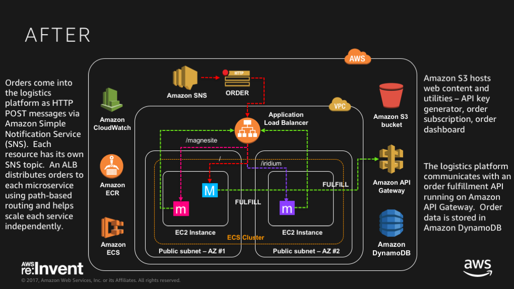

Please help us get there!

### Requirements:  
* AWS account - if you don't have one, it's easy and free to [create one](https://aws.amazon.com/)
* AWS IAM account with elevated privileges allowing you to interact with CloudFormation, IAM, EC2, ECS, ECR, ELB/ALB, VPC, SNS, CloudWatch
* A workstation or laptop with an ssh client installed, such as [putty](http://www.putty.org/) on Windows; or terminal or iterm on Mac
* Some familiarity with Python, vim/emacs/nano, [Docker](https://www.docker.com/), and AWS; not totally needed, but helpful for your workshop experience.  

### Labs:  
These labs are designed to be completed in sequence, and the full set of instructions are documented below.  Read and follow along to complete the labs.  If you're at a live AWS event, the workshop attendants will give you a high level run down of the labs and be around to answer any questions.  Don't worry if you get stuck, we provide hints along the way.  

* **Workshop Setup:** Setup working environment on AWS  
* **Lab 1:** Build and deploy monolith container using Amazon ECS
* **Lab 2:** Incrementally build and deploy a microservice
* **Lab 3:** Scale microservices with an Application Load Balancer (ALB)

### Conventions:  
Throughout this workshop, we provide commands for you to run in the terminal.  These commands will look like this: 

<pre>
$ ssh -i <b><i>PRIVATE_KEY.PEM</i></b> ec2-user@<b><i>EC2_PUBLIC_DNS_NAME</i></b>
</pre>

The command starts after the $.  Text that is ***UPPER_ITALIC_BOLD*** indicates a value that is unique to your environment.  For example, the ***PRIVATE\_KEY.PEM*** refers to the private key of an SSH key pair that you've created, and the ***EC2\_PUBLIC\_DNS\_NAME*** is a value that is specific to an EC2 instance launched in your account.  You can find these unique values either in the CloudFormation outputs or by going to the specific service dashboard in the AWS management console.

Hints are provided along the way and will look like:

HINT

Sweet, you just revealed a hint!

Click on the arrow to show the contents of the hint.  

### Workshop Cleanup:
You will be deploying infrastructure on AWS which will have an associated cost.  Fortunately, this workshop should take no more than 2 hours to complete, so costs will be minimal.  When you're done with the workshop, follow these steps to make sure everything is cleaned up.  

1. Delete any manually created resources throughout the labs.  Certain things do not have a cost associated, and if you're not sure what has a cost, you can always look it up on our website.  All of our pricing is publicly available, or feel free to ask one of the workshop attendants when you're done. 
2. Delete any container images stored in ECR, delete CloudWatch logs groups, and delete ALBs and target groups (if you get to that lab) 
3. Delete the CloudFormation stack launched at the beginning of the workshop to clean up the rest.

* * * 

## Let's Begin!  
  
### Workshop Setup:

1\. Log into the AWS Management Console and select an [AWS region](http://docs.aws.amazon.com/AWSEC2/latest/UserGuide/using-regions-availability-zones.html).  The region dropdown is in the upper right hand corner of the console to the left of the Support dropdown menu.  For this workshop, choose either **Ohio** or **Oregon** or **Ireland**.  Workshop administrators will typically indicate which region you should use.

2\. Create an [SSH key pair](http://docs.aws.amazon.com/AWSEC2/latest/UserGuide/ec2-key-pairs.html) that will be used to login to launched EC2 instances.  If you already have an SSH key pair and have the PEM file (or PPK in the case of Windows Putty users), you can skip to the next step.  

Go to the EC2 Dashboard and click on **Key Pairs** in the left menu under Network & Security.  Click **Create Key Pair**, provide a name (e.g. interstella-workshop), and click **Create**.  Download the created .pem file, which is your private SSH key.      

*Mac or Linux Users*:  Change the permissions of the .pem file to be less open using this command:

<pre>$ chmod 400 <b><i>PRIVATE_KEY.PEM</i></b></pre>

*Windows Users*: Convert the .pem file to .ppk format to use with Putty.  Here is a link to instructions for the file conversion - [Connecting to Your Linux Instance from Windows Using PuTTY](http://docs.aws.amazon.com/AWSEC2/latest/UserGuide/putty.html)

3\. Generate a Fulfillment API Key for the logistics software [here](http://www.interstella.trade/getkey.html).  Create a username and password to login to the API Key Management portal; you'll need to access this page again later in the workshop, so don't forget what they are.  Click **GetKey** to generate an API Key.  Note down your username and API Key because we'll be tracking resource fulfillment rates.  The API key will be used later to authorize the logistics software send messages to the order fulfillment API endpoint (see arch diagram in Lab 1).

4\. For your convenience, we provide a [CloudFormation](http://docs.aws.amazon.com/AWSCloudFormation/latest/UserGuide/Welcome.html) template to stand up core workshop infrastructure.

Here is what the workshop environment looks like:

The CloudFormation template will launch the following:
* VPC with public subnets, routes and Internet Gateway
* EC2 Instances with security groups (inbound tcp 22, 80, 5000) and joined to an ECS cluster 
* ECR repositories for the monolith and microservices
* Parameter store to hold values for API Key, fulfillment API endpoint, and SNS Orders topic

*Note: SNS Orders topic, S3 assets, API Gateway and DynamoDB tables are admin components that run in the workshop administrator's account.  If you're at a live AWS event, this will be provided by the workshop facilitators.  We're working on packaging up the admin components in an admin CloudFormation template, so you can run this workshop at your office, home, etc.*

Click on the CloudFormation launch template link below for the region you selected in Step 1.  The link will load the CloudFormation Dashboard and start the stack creation process in the specified region.

Region | Launch Template
------------ | -------------  
**Ohio** (us-east-2) | [Launch Interstella CloudFormation Stack in Ohio](https://console.aws.amazon.com/cloudformation/home?region=us-east-2#/stacks/new?stackName=Interstella-workshop&templateURL=https://s3-us-west-2.amazonaws.com/www.interstella.trade/workshop2/starthere.yaml)  
**Oregon** (us-west-2) | [Launch Interstella CloudFormation Stack in Oregon](https://console.aws.amazon.com/cloudformation/home?region=us-west-2#/stacks/new?stackName=Interstella-workshop&templateURL=https://s3-us-west-2.amazonaws.com/www.interstella.trade/workshop2/starthere.yaml)
**Ireland** (eu-west-1) | [Launch Interstella CloudFormation Stack in Ireland](https://console.aws.amazon.com/cloudformation/home?region=eu-west-1#/stacks/new?stackName=Interstella-workshop&templateURL=https://s3-us-west-2.amazonaws.com/www.interstella.trade/workshop2/starthere.yaml)

You should be on the Select Template page, notice an S3 URL link to the CloudFormation template is already populated.  Click **Next** to continue without modifying any fields on this page.

5\. On the Specify Details step of the Create Stack process, enter values for the following fields:

* **Stack name** - this is just a logical identifier for your CloudFormation stack
* **EnvironmentName** - this name is to used to tag resources created by CloudFormation

IMPORTANT NOTE: for this workshop, please use only lowercase letters because the ECR repository name users this CloudFormation parameter and ECR repository names can only contain lower case letters.

* **KeyPairName** - select the key pair that you created from Step 1
* **InterstellaApiKey** - enter the API key generated from Step 3
* **InterstellaApiEndpoint** - replace this default value if the workshop admins provide you a different fulfillment API endpoint (in the form of a URL) to use
* **InterstellaOrdersTopicArn** - replace this default value, if the workshop admins provide you an SNS orders topic (in the form of an ARN) to use

All other fields can be left as their default values.  

Click **Next** to move on to the Options page.  

6\. No changes or inputs are required on the Options page.  Click **Next** to move on to the Review page.

7\. On the Review page, scroll down to the Capabilities section and click on the checkbox next to *"I acknowledge that AWS CloudFormation might create IAM resources with custom names."*.  If you do not check this box, the stack creation will fail.

Click **Create** to launch the CloudFormation stack. 

### Checkpoint:  
The CloudFormation stack will take a few minutes to lauch.  Periodically check on the stack creation process in the CloudFormation Dashboard.  Your stack should show status **CREATE\_COMPLETE** in roughly 5-10 minutes.  If you select box next to your stack and click on the **Events** tab, you can see what steps it's on.  

If there was an [error](http://docs.aws.amazon.com/AWSCloudFormation/latest/UserGuide/troubleshooting.html#troubleshooting-errors) during the stack creation process, CloudFormation will rollback and terminate.  You can investigate and troubleshoot by looking in the Events tab.  Any errors encountered during stack creation will appear in the event stream as a failure.

* * * 

### Lab 1 - Build and deploy monolith container using Amazon ECS:    

In this lab, you will build the logistics software (i.e. monolith) Docker image from a provided Dockerfile and deploy the container using ECS.  If you're new to ECS or need a refresher, ECS is a container management service for deploying Docker containers across a fleet of EC2 instances.  ECS uses a JSON formatted template called a [Task Definition](http://docs.aws.amazon.com/AmazonECS/latest/developerguide/task_definitions.html) that describes one or more containers that make up your application or unit of work.  With task definitions, you can specify things like container image(s) you want to use, host:container port mappings, cpu and memory allocations, logging, and more.   

Here is a reference architecture for what you will be implementing in Lab 1:

*Reminder: You'll see SNS topics, S3 bucket, API Gateway and DynamoDB in the diagram.  These are provided by Interstella HQ for communicating orders and fulfilling orders.  They're in the diagram to show you the big picture as to how orders come in to the logistics platform and how orders get fulfilled*

*If you are attending a live AWS event, these assets will be provided.  We're working on packaging up the admin components, so you can run this workshop at your office, home, etc.*

1\. SSH into one of the launched EC2 instances to get started.

Go to the EC2 Dashboard in the Management Console and click on **Instances** in the left menu.  Select either one of the two EC2 instances created by the CloudFormation stack, note down the **Public IP** and SSH into the instance.

*Tip: If your instances list is cluttered with other instances, type the **EnvironmentName** you used when running your CloudFormation template into the filter search bar to reveal only those instances.*  

*Note: Keep the public IP handy because you will use this instance again for building the microservices images and modifying the monolith code in the next lab.*

<pre>
$ ssh -i <b><i>PRIVATE_KEY.PEM</i></b> ec2-user@<b><i>EC2_PUBLIC_IP_ADDRESS</i></b>
</pre>

If you see something similar to the following message (host IP address and fingerprint will be different, this is just an example) when trying to initiate an SSH connection, this is normal when trying to SSH to a server for the first time.  The SSH client just does not recognize the host and is asking for confirmation.  Just type **yes** and hit **enter** to continue:

<pre>
The authenticity of host '52.15.243.19 (52.15.243.19)' can't be established.
RSA key fingerprint is 02:f9:74:ef:d8:5c:19:b3:27:37:57:4f:da:37:2b:e8.
Are you sure you want to continue connecting (yes/no)? 
</pre>

2\. Once logged onto the instance, create a working directory for the monolith code, and download the logistics application source, requirements file, and Dockerfile from Interstella's site.  

Note: the flag for the curl command below is a capital O, not a zero.   

<pre>
$ mkdir -p code/monolith
$ cd code/monolith
$ curl -O http://www.interstella.trade/workshop2/code/monolith/monolith.py
$ curl -O http://www.interstella.trade/workshop2/code/monolith/requirements.txt
$ curl -O http://www.interstella.trade/workshop2/code/monolith/Dockerfile
</pre>

3\. Build the image using the [Docker build](https://docs.docker.com/engine/reference/commandline/build/) command.  Note the trailing period.

<pre>
$ docker build -t monolith .
</pre> 

You'll see a bunch of output as Docker builds all the layers to the image.  If there is a problem along the way, the build process will fail and stop.  You may see some warnings during build process; for this workshop, don't worry about it unless the build process stops.  You'll see a success message at the end of the build output like this:

<pre>
Step 15/15 : ENTRYPOINT bin/python monolith.py
---> Running in 188e00e5c1af
---> 7f51e5d00cee
Removing intermediate container 188e00e5c1af
Successfully built 7f51e5d00cee
</pre>

*Note: Your output will not be exactly like this, but it will be similar.*

You can list your docker images to see the image you just built.  Here's a sample output with the monolith image in the list: 

<pre>
[ec2-user@ip-10-177-10-249 ~]$ docker images
REPOSITORY               TAG        IMAGE ID        CREATED             SIZE
monolith                 latest     87d3de20e191    17 seconds ago      532 MB
&lt;none&gt;                   &lt;none&gt;     850d78c7aa5f    27 minutes ago      735 MB
golang                   1.9        1a34fad76b34    8 days ago          733 MB
ubuntu                   14.04      3aa18c7568fc    8 days ago          188 MB
amazon/amazon-ecs-agent  latest     96e5393c89d4    6 weeks ago         25.4 MB
</pre>

*Note: Your output will not be exactly like this, but it will be similar.*

4\. Run the docker container to make sure it is working as expected.  Interstella's logistics platform will automatically subscribe to the SNS orders feed and is configured to send fulfillment to the order fulfillment API.  Issue the [docker run](https://docs.docker.com/engine/reference/run/) command and use the -p flag to map host port 5000 to container port 5000.  

<pre>
$ docker run -p 5000:5000 monolith
</pre>

You should see output similar to this:

<pre>
[ec2-user@ip-10-177-10-249 ~]$ docker run -p 5000:5000 monolith
 * Running on http://0.0.0.0:5000/ (Press CTRL+C to quit)
 * Restarting with stat
 * Debugger is active!
 * Debugger PIN: 265-056-304
54.240.230.188 - - [13/Nov/2017 01:46:52] "POST /order/ HTTP/1.1" 200 -
54.240.230.246 - - [13/Nov/2017 01:46:53] "POST /order/ HTTP/1.1" 200 -
</pre>

*Note: You'll see inbound POST requests start printing out.  Your output will not be exactly like this, but it will be similar.*

Use **Ctrl-C** to stop the container.  

5\. Now that you have a deployable container, tag and push the image to Amazon EC2 Container Registry (ECR).  You now have version control and persistence, and ECS will reference the image from ECR when deploying the container.    

In the AWS Management Console, navigate to the ECS dashboard and click on **Repositories** in the left menu.  You should see the Docker image repositories created by CloudFormation for the monolith and resource microservices prefixed by the EnvironmentName you specified in the CloudFormation template.  Here's an example where I used 'interstella' as the EnvironmentName:  

Click on the repository name containing '-monolith', and note the Repository URI:

*Note: Your repository URI will be unique.  Copy it somewhere, you will need it in the following commands and again later in the lab.*

Tag and push your container image to the repository.

<pre>
$ docker tag monolith:latest <b><i>ECR_REPOSITORY_URI</i></b>:latest
$ docker push <b><i>ECR_REPOSITORY_URI</i></b>:latest
</pre>

When you issue the push command, Docker pushes the layers up to ECR, and if you refresh the monolith repository page, you'll see an image indicating the latest version.  

*Note: that you did not need to authenticate docker with ECR because the [Amazon ECR Credential Helper](https://github.com/awslabs/amazon-ecr-credential-helper) has been installed and configured for you on the EC2 instance.  This was done as a bootstrap action when launching the EC2 instances.  Review the CloudFormation template and you will see where this is done.  You can read more about the credentials helper in this blog article - https://aws.amazon.com/blogs/compute/authenticating-amazon-ecr-repositories-for-docker-cli-with-credential-helper/*

6\. Before you deploy the container, let's first set up a logging destination to aggregate container logs.  ECS offers integration with CloudWatch logs through an awslogs driver that can be enabled in the container definition. 

Navigate to the CloudWatch dashboard and create a CloudWatch Log group.  

Click on **Logs** in the left menu.  In the **Actions** drop down, select **Create log group** and enter a name for the group, e.g. interstella-monolith  

  

7\. Now you're ready to create a an ECS task definition and deploy the monolith container.

In the AWS Management Console, navigate to the Elastic Container Service dashboard.  Click on **Task Definitions** in the left menu.  Click on **Create New Task Definition**.  

Enter a name for your Task Definition, e.g. interstella-monolith.  Leave Task Role and Network Mode as defaults. 

Add a container to the task definition.  

Click **Add container**.  Enter values for the following fields:
* **Container name** - this is a logical identifier, not the name of the container image, e.g. monolith
* **Image** - this is a reference to the container image stored in ECR.  The format should be the same value you used to push the container to ECR - <pre><b><i>ECR_REPOSITORY_URI</i></b>:latest</pre>
* **Memory Limits** - select **Soft limit** from the drop down, and enter **128**.  

*Note: This assigns a soft limit of 128MB of RAM to the container, but since it's a soft limit, it does have the ability to consume more available memory if needed.  A hard limit will kill the container if it exceeds the memory limit.  You can define both for flexible memory allocations.  Resource availability is one of the factors that influences container placement.  You can read more about [ContainerDefinitions](http://docs.aws.amazon.com/AmazonECS/latest/APIReference/API_ContainerDefinition.html) in our documentation*

* **Port mappings** - enter **5000** for both the host and container port.  

*Note: ECS offers a dynamic port mapping feature when using the ALB as a load balancer for your container service.  This means you can run multiple copies of a container on a single host.  The container listening port remains the same, but the host port is assigned an ephemeral port number; ECS also takes care of mapping your containers to the ALB target group.  We'll visit this in the last lab when scaling the microservices with ALB.*

Your container definition should look something like this so far:

 

Expand the **Advanced container configuration** to set the **Log Configuration** and configure these settings.  

* **Log driver** - select **awslogs** from the drop-down
* **Log options** - enter the name of the CloudWatch log group that you created in the last step, and enter the AWS region of the log group.  You can leave stream prefix blank; this setting is useful when you want to log multiple log sources to a single log group.  We could have done that, but opted for distinct CloudWatch log groups because we are breaking apart the monolith into microservices after all.  

Leave the remaining fields as is and click **Add** to associate this container with the task definition. 

Click **Create** to finish creating the task definition. 

8\. You should be at the task definition view where you can see information pertaining to the task definition you just created.  Let's run the monolith as an ECS Service, which maintains a desired task count, i.e. number of containers, as long running processes.  

In the **Actions** dropdown, select **Create Service**.  

Fill in the following fields:
* **Service Name** - this is a logical identifier for your service, e.g. interstella-monolith
* **Number of tasks** - set to **1** for now; you will horizontally scale this service in the last lab with a new ECS service

*Note: There are many options to explore in the Task Placement section of the Run Task action, and while we will not touch on every configuration in this workshop, you can read more about [Scheduling Tasks](http://docs.aws.amazon.com/AmazonECS/latest/developerguide/scheduling_tasks.html) in our documentation.*

Leave the other fields as default and click **Next step**

Load balancing will come into play during the last lab, for now click **Next step** to continue.  

Click **Next step** to skip the auto scaling option.  

Click **Create Service** and click **View Service** to get the status of your service launch.  The *Last Status* will show **RUNNING** once your container has launched.  

9\. Confirm logging to CloudWatch Logs is working. 

Once the monolith service is running, navigate back to the CloudWatch Logs dashboard, and click on your log group.  As your container processes orders, you'll see a log stream appear in the log group reflecting the HTTP POST logs written to stdout you saw earlier.  

Click on the log stream to view log entries.    

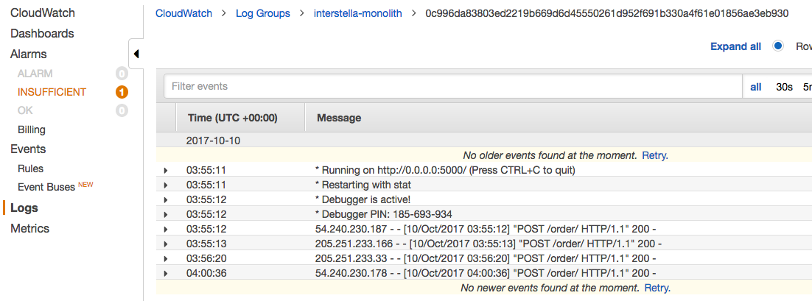

### Checkpoint:  
At this point you have a working container for the monolith codebase stored in an ECR repository.  You've created a task definition referencing the monolith container image and deployed it as an ECS service.  Logs are delivered to CloudWatch Logs, so you can verify your container is processing orders as expected.  Now you're ready to get started with breaking apart the monolith.  

* * *

### Lab 2 - Incrementally build and deploy a microservice:

In this lab, you will start to break apart Interstella's logistics platform monolith into microservices. To help with this, the first thing we'll do is explain how the monolith works in more detail. 

When a request first comes in, all four resources are gathered in sequence. Then, once it's confirmed that everything has been gathered, they are fulfilled back to the customer. Logically, you can think of this as five separate services. One per resource and one for fulfillment. The goal for this lab is to remove those functions from the monolith and implement as their own micrservice.

When moving to microservices, there are some patterns that are fairly common. One is to rewrite your entire application with microservices in mind. While this is nice and you have great code to work with going forward, it's often not feasible. 

Hence, Interstella has chosen to move forward with the "Strangler Application" pattern which they've had success with in the past. Instead of breaking every single service apart, we will be taking some parts of the monolith out and making those into microservices while creating some new integrations into the monolith to use legacy code. This introduces less risk to the overall migration and allows teams to iterate quickly on the services that have been moved out. Eventually, there will be very little left in the monolith, effectively rendering it strangled.

Here is a reference architecture for what you will be implementing in Lab 2.  The capital 'M' denotes the monolith and 'm' a microservice:

First thing's first. We're using microservices now, so we must define service contracts between your microservice and any other services it will have to access. In this lab, the flow will be:

* Customer orders are delivered as HTTP POST messages from an SNS topic - there will be a topic per resource.  The payload of the order is JSON - e.g.{"iridium": 1}.
* Microservice gathers resources and sends JSON to the monolith via a new integration hook for fulfillment.  
* The fulfillment service maps the JSON to the original API contract between the monolith and customer - {'iridium': #, 'magnesite': #}. This integration hook is in monolith.py and is named glueFulfill()

1\. Let's start by removing the iridium production from the monolith. You should still have an existing SSH session open to the EC2 instance you used to build the monolith container image earlier. If not, SSH into the same instance.

<pre>
$ ssh -i <b><i>PRIVATE_KEY.PEM</i></b> ec2-user@<b><i>EC2_PUBLIC_IP_ADDRESS</i></b>
</pre>

Our dev team already prepared microservices code and Dockerfile for iridium production, so you just have to build the Docker image as a starting point.  These are similar steps from the last lab, so you should be familiar with the process.  

Create a working directory for the iridium code, and download the iridium application source, requirements file, and Dockerfile from Interstella's site.  

<pre>
$ cd
$ mkdir -p code/iridium
$ cd code/iridium
$ curl -O http://www.interstella.trade/code/iridium/Dockerfile
$ curl -O http://www.interstella.trade/code/iridium/requirements.txt
$ curl -O http://www.interstella.trade/code/iridium/iridium.py
</pre>

2\. Build the new iridium production Docker image.

<pre>
$ docker build -t iridium .
</pre>

3\. Tag and push the image to the ECR repository for iridium.  

To find the ECR repo URI, navigate to the ECS dashboard in the management console, click on **Respositories** and find the repo with '-iridium' in the name.  Click on the iridium repository and copy the repository URI.

Enter the following commands substituting in the iridium repository URI (make sure you do NOT use the monolith repository URI):

<pre>
$ docker tag iridium:latest ECR_REPOSITORY_URI:latest
$ docker push ECR_REPOSITORY_URI:latest
</pre>

4\. In order for your new microservices to hook back into the monolith, we need to find the IP and port mappings of the monolith. Navigate back to the Elastic Container Service Dashboard. Click on **Clusters** and then again on your ECS cluster.

Click on the **Tasks** tab and find the specific task for the monolith service that's in a RUNNING state.  Click on the task to expand details.

Click on the **Container Instance** ARN, which looks like below:

This loads details of the host that is running the monolith container.  Note the **Public IP** address.  You will use this to link the iridium microservice to the fulfillment service that's running on the monolith in the next step.

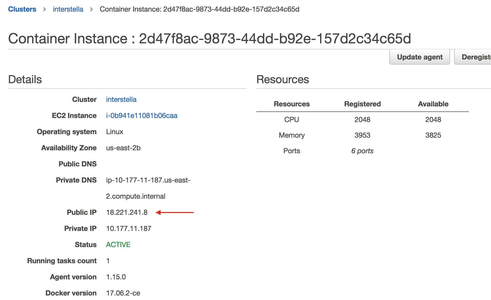

5\. Create a new **Task Definition** for the iridium service. 

In the AWS Management Console, navigate to the Elastic Container Service dashboard.  Click on **Task Definitions** in the left menu.  Click on **Create New Task Definition**.

Enter a name for your Task Definition, e.g. interstella-iridium.

Add a container to the task definition.  Click **Add container**.  Enter values for the following fields:
* **Container name** - this is a logical identifier, not the name of the container image, e.g. iridium
* **Image** - this is a reference to the container image stored in ECR.  The format should be the same value you used to push the container to ECR - <pre><b><i>ECR_REPOSITORY_URI</i></b>:latest</pre>
* **Memory Limits** - select **Soft limit** from the drop down, and enter **128**.  
* **Port mapping** - set host and container ports to be 80

The iridium app code is designed to use the monolith integration hook to send order fulfillment to the fulfillment service running on the monolith.  It needs the monolith endpoint stored in an environment variable.

Scroll down to the **Advanced container configuration** section, and create an environment variable named "monolithUrl". For the value, enter the **Public IP** address of the host running the monolith service you copied in step 7.

Finally, let's add logging.  We'll use CloudWatch logs like with the monolith.  Scroll down to the **Log configuration** section, select "awslogs" from the **Log driver** dropdown, enter "interstella-iridium" as the logs group (CloudFormation already created this log group for you), and enter the AWS region of the logs group.  Here's an example of what it should look like:

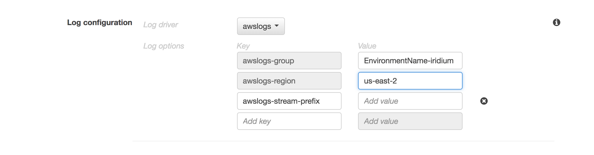

Click **Add**, and click **Create**.

6\. Run the task.

Under the **Actions** dropdown, click **Run task**.  You should see the iridium task launch as PENDING.  Give it some time and click the refresh button to see the task enter RUNNING state.  

7\. Check CloudWatch Logs to confirm the microservice is receiving and processing orders.  Go to the **CloudWatch Dashboard**, click **Logs**, and click on your log group to view the latest log stream.

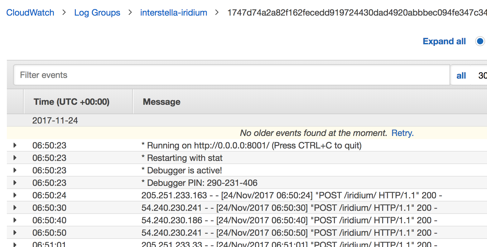

8\. Now that the iridium microservice is running, it's time to remove the functionality from the monolith. Go back to the SSH session where you built the monolith and iridium container images.  Navigate to the monolith working folder.

<pre>
$ cd ~/code/monolith/
</pre>

Open monolith.py with your favorite text editor, and comment the line that reads: 

<pre>
iridiumResult = iridium()
</pre>

*Tip: if you're not familiar with Python, you can comment out a line by adding a hash character, "#", at the beginning of the line.*

It should be line 96, in the app route decorator for the /order/ URL:

Save your changes and close the file.

HINT

If you get stuck or don't really know your way around linux text editors, you can download lab2-monolith.py from Interstella HQ to the EC2 instance and replace the old file with these commands.

<pre>
$ cd ~/code/monolith
$ curl -O http://www.interstella.trade/workshop2/hints/lab2-monolith.py
$ mv lab2-monolith.py monolith.py
</pre>

9\. Build, tag and push the monolith again to write the changes into the monolith image.  Note the tag "noiridium" instead of "latest".  This is a best practice because it makes the specific deployment unique and easily referenceable.  

<pre>
$ docker build -t monolith:noiridium .
$ docker tag monolith:noiridium <b><i>ECR_REPOSITORY_URI</i></b>:noiridium
$ docker push <b><i>ECR_REPOSITORY_URI</i></b>:noiridium
</pre>

If you look in the ECR repository for the monolith, you'll see the image tagged "noiridium".

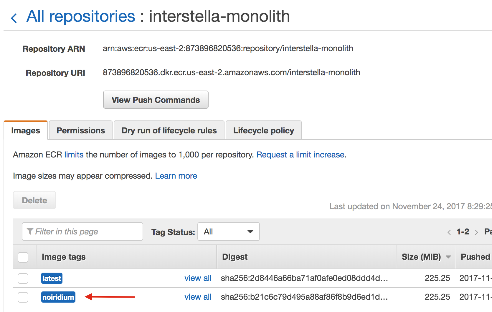

10\. Create a new revision of the monolith task definition. 

Navigate to the EC2 Container Service dashboard and click **Task Definitions** in the left menu.  Select the task definition for the monolith and click **Create new revision**.

 

*Note: Your task definition may be different depending on the name you chose.* 

In the **Container Definitions** section, click on the container name to edit the container image for the task definition.

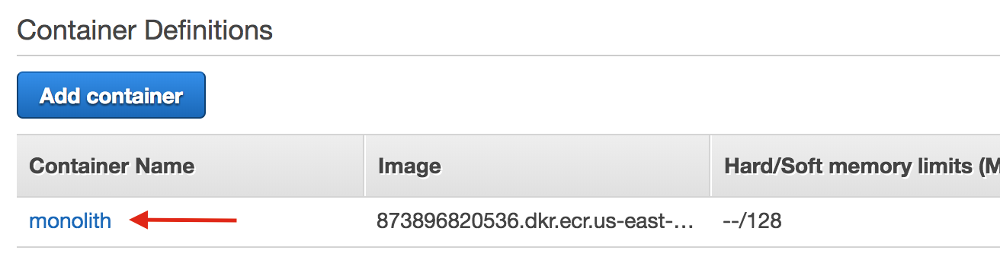

*Note: Your container name may be different depending on the name you chose.*

Modify the image tag from "latest" to "noiridium".

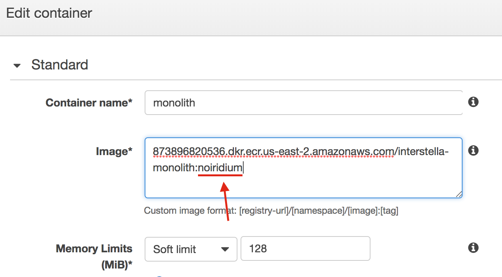

*Note: Your ECR repository URI will be unique*

Click **Update**, and click **Create**.

11\. Earlier you deployed the monolith as an ECS service.  Update the service to use the new task definition you just created.

In the ECS dashboard, click on **Clusters** in the left menu.  Click on your workshop cluster.  You should see the monolith service running in the **Services** tab.  Select the monolith service and click **Update**.

Change the **Task Definition** to be the newest version you just created.  If your earlier task definition was "interstella-monolith:1" for example, you should see a "interstella-monolith:2" in the drop-down menu.  If you're unsure, you can always go back to the **Task Definitions** section of the ECS dashboard to check.

Click **Next step** for this step and remaining steps without making any additional modifications.  Click **Update Service** to deploy your new monolith container.  Click on **View Service** and then on the **Tasks** tab and you should see your new task definition running.

You might have noticed something interesting happen.  There's a high probability the service update launched your new container on the other EC2 container instance.  This is the default [task placement](http://docs.aws.amazon.com/AmazonECS/latest/developerguide/task-placement.html) logic to evenly spreading tasks across availability zones (AZs).  This is a great feature, but a problem in this case because when you configured the iridium task definition, you had set an environment variable "monolithUrl" and passed it the IP address of the instance running the monolith container.  Since the monolith is running on the other EC2 host, the iridium service is no longer able to fulfill orders through the fulfillment service running on the monolith.

We need service discovery to identify the microservices endpoints.  Here are a few patterns that could work:
* [DNS/Route53 without load balancing](https://aws.amazon.com/blogs/compute/service-discovery-for-amazon-ecs-using-dns/), 
* [DNS/Route53 and ELB](https://aws.amazon.com/blogs/compute/service-discovery-an-amazon-ecs-reference-architecture/)
* [3rd party tools such as Consul](https://aws.amazon.com/blogs/compute/service-discovery-via-consul-with-amazon-ecs/) or Weave

We're going to use the 2nd pattern above, though leaving out the DNS part for now since we're in a dev environment.  We'll use an Application Load Balancer (ALB) to be the front door for our microservices and monolith (which is essentially strangled down to a fulfillment service).  A load balancer will also allow us to horizontally scale our processing capacity, bonus!

12\. Since the monolith-iridium integration is not currently working, let's stop the monolith service and stop the iridium task.

You should still be in the monolith service view.  Click on the **Update** button, and in Step 1: Configure service, set **Number of tasks** to be **0**.  

Click **Next step** for this step and remaining steps without making any additional modifications.  Click **Update Service**.  Click on **View Service** and then on the **Tasks** tab.  Notice no running tasks, **Desired Count** is now **0** and **Running count** eventually drops to **0** as well.

The service view has a link to your workshop cluster, click on the workshop cluster name to open that view, so we can find and stop the iridium task.  

Click on the **Tasks** tab, select the iridium task, and click **Stop** to kill the iridium service.

###Checkpoint:
By this point, you've containerized the Interstella logistics platform (aka monolith) and the iridium microservice.  Images for these environments are stored in ECR and can be deployed with ECS.  At one point you had the iridium microservice running and sending processed orders to the monolith, so you know the integration works.  We'll worry about the magnesite microservice in the next lab.

### Lab 3 - Scale the logistics platform with ALB: 

In this lab, you will continue the journey to microservices by introducing an ALB to front-end your fulfillment service (running on monolith) and resource microservices.  The ALB will help identify and scale each microservice endpoint by load balancing across a pool of containers.

ALB/ECS integration offers a feature called dynamic port mapping, which enables you to run multiple copies of the same container with the same listening port on the same host...say that 10 times fast.  With dynamic port mapping, an ephemeral listening port is automatically assigned to the host and mapped to the container.

Another key ALB feature you'll take advantage of is path-based routing, which routes traffic based on URL path to particular target groups.  Monolith/fulfillment will be the default path, '/'.  Iridium and magnesite will be '/iridium' and '/magnesite', respectively.  This means we'll only need to run one instane of ALB.

Here is a reference architecture for what you will be implementing in the Lab 3:

Let's start by putting the monolith behind an ALB.

1\. First, make the following updates in the monolith app code:
* Disable the monolith from self-registering to SNS
* Disable bundle order processing - this puts all resource processing on the microservices and the monolith only handles order fulfillment.

You should still have your SSH session open, but if not, SSH into the same EC2 instance you've been using to build container images throughout the workshop.  Navigate to the monolith code directory and open monolith.py with your favorite text editor.  

Comment out the lines in the app code that subscribes to SNS - it's noted with a comment reading '# Subscribe SNS'.  

HINT

If you're not familiar with multi-line comments in Python, this is done by surrounding the text in triple single quotes, '''.

<pre>
'''
This is an example of a
multi-line
comment
'''
</pre>

SNS subscribe code should look like this commented out:

<pre>
# Subscribe SNS
'''
snsClient = boto3.client('sns',region_name=orderTopicRegion)
ip = urlopen('http://169.254.169.254/latest/meta-data/public-ipv4').read().decode('utf-8')
ip = 'http://'+ip+':'+str(portNum)+'/order/'

response = snsClient.subscribe(
    TopicArn=orderTopic,
    Protocol='http',
    Endpoint=ip
)
'''
</pre>

Also, since orders will go directly to each resource microservice, you can comment out the /order/ route for the application.  This is the URL path where orders were originally being sent and processed.  Find the block of code starting with the comment "# Effectively, our subscriber service.":

Code should look like this after adding the triple single quotes:

<pre>
# Effectively, our subscriber service.
'''
@app.route('/order/', methods=['POST'])
def order():
    if request.method == 'POST':
        try: 
            iridiumResult = 0
            magnesiteResult = 0
            # Is this a normal SNS payload? Try to get JSON out of it
            payload = request.get_json(force=True)
            if 'SubscribeURL' in payload:
                print 'Incoming subscription request from SNS...'
                # print payload['SubscribeURL']
                print 'Sending subscription confirmation to SNS...'
                response = requests.get(payload['SubscribeURL'])
                # print response.status_code
                if response.status_code == requests.codes.ok:
                    return "SNS topic subscribed!"
                else:
                    response.raise_for_status()
            elif 'bundle' in payload['Message']:
                print 'Gathering Requested Items'
                iridiumResult = iridium()
                magnesiteResult = magnesite()
                response = fulfill(apiKey, endpoint, iridiumResult, magnesiteResult)
                if response == requests.codes.ok:
                    print 'Bundle fulfilled'
                    return 'Your order has been fulfilled'
                else:
                    # print response
                    return 'Your order has NOT been fulfilled'
        except Exception as e:
            # Looks like it wasn't.
            print e
            print 'This was not a fulfillment request. Moving on...'
            return 'We were unable to place your order'
        
        return "This was not a fulfillment request. Moving on..."
    else:
        # We should never get here
        return "This is not the page you are looking for"
'''
</pre>

Save and close the file.

HINT

If you get stuck or don't really know your way around linux text editors, you can download lab3-monolith.py from Interstella HQ to the EC2 instance and replace the old file with these commands.

<pre>
$ cd ~/code/monolith
$ curl -O http://www.interstella.trade/workshop2/hints/lab3-monolith.py
$ mv lab3-monolith.py monolith.py
</pre>

2\. After making the edits to the monolith app code, rebuild the monolith container image, tag the image as "monolith:noresources", and push the new container image to the monolith ECR repository.

HINT

Here are the commands:
<pre>
$ docker build -t monolith:noresources .
$ docker tag monolith:noresources <b><i>ECR_REPOSITORY_URI</i></b>:noresources
$ docker push <b><i>ECR_REPOSITORY_URI</i></b>:noresources
</pre>

2\. Now we're ready to create an Application Load Balancer.

In the AWS Management Console, navigate to the EC2 dashboard.  Click on **Load Balancers** in the left menu under the **Load Balancing** section.  Click on **Create Load Balancer**.  Click on **Create** for an Application Load Balancer.

Give your ALB a name, e.g. interstella.

Under **Listeners**, leave the port as port 80.

Under **Availability Zones**, select the workshop VPC from the drop-down menu.  You can identify the workshop VPC in the list by the tag, which should be the same as the EnvironmentName from the CloudFormation parameters you provided.  Select one of the Availability Zones (AZ) and select the Public subnet in that AZ; the **Name** column will indicate which subnet is public.  Repeat with the other AZ.

The settings should look similar to this (your subnet IDs will be unique):  

Leave all other settings as the defaults and click **Next: Configure Security Settings** to move to ALB config Step 2.

Since we're not setting up https, click **Next: Configure Security Groups** to move to ALB Step 3.

*Note: It's highly recommend in real world cases to implement SSL encryption for any production systems handling private information.  Our lab is designed to illustrate conceptual ideas and does not implement SSL for simplicity...and it's not a real company.*

You'll notice a security group that starts with your **EnvironmentName** from CloudFormation stack creation and has **LoadBalancerSecurityGroup** in the name.  This was provisioned by the CloudFormation template for your convenience.  Select that security group and click **Next: Configure Routing** to move to ALB Step 4.

ALB routes incoming traffic to a target group associated with your ALB listener; targets in this case are the instances hosting your containers.

Enter a name for the new target group, e.g. monolith.  Enter **5000** for the port.  Leave other settings as defaults and click **Next: Register Targets** to move to ALB Step 5.

Amazon ECS handles registration of targets to your target groups, so do you **NOT** have to register targets in this step.  Click **Next: Review**, and on the next page, click **Create**.

Note down the DNS name for the created ALB.

3\. Now let's modify the monolith ECS task definition to reference the new monolith container image you just built and pushed to ECR, and remove the host port in the container definition to take advantage of dynamic port mapping.  By leaving the host port blank, an ephemeral port will be assigned and ECS/ALB integration will handle the mapping.

Here's what the new task definition should look like:

If you need a reminder how to create a new revision of a task definition, review Lab 2 Step 10.

4\. You ran monolith as an ECS service in lab 2, so the steps should be familiar.  We're going to create a new ECS service since the ALB created in step 1 will be included in the configuration.

You should still be on the screen showing the new revision of the task definition you just modified.  Under the **Actions** drop down, choose **Create Service**.

Enter a name for the service, e.g. monolith-alb, and set **Number of tasks** to be **1** for now.  Keep other settings as their defaults and click **Next Step**

On the next page, select **Application Load Balancer** for **Load balancer type**.

You'll see a **Load balancer name** drop-down menu appear.  Select the ALB you created earlier.

In the **Container to load balance** section, select the **Container name : port** combo from the drop-down menu that corresponds to the task definition you edited in step 3.

Click **Add to load balancer**.  More fields related to the container will appear.

For the **Listener Port**, select the ALB listener configured earlier.

For the **Target Group Name**, select the target group created earlier during ALB setup.

Leave the other fields as defaults and click **Next Step**.

Skip the Auto Scaling configuration by clicking **Next Step**.

*Note: ECS supports Task auto scaling which can automatically increased and describe your desired task count based on dynamic metrics.  We'll skip this for now; you can experiment with this later if you have time.*

Click **Create Service**.

*Note: There were many other configuration options, and you can read more about [ECS Services](http://docs.aws.amazon.com/AmazonECS/latest/developerguide/ecs_services.html) and [ALB Listeners](http://docs.aws.amazon.com/elasticloadbalancing/latest/application/load-balancer-listeners.html) in our documentation*

Once the Service is created, click **View Service** and you'll see your task definition has been deployed.

5\. Now let's fix the iridium microservice you created earlier.  There are a few things you need to do:
* Disable the iridium microservice from self-registering to SNS because you're going to put it behind the ALB; similar to the monolith, this is how the app was designed
* Update the fulfill service port in the iridium app code
* Update the container environment variable set in the iridium task definition to point to the public DNS of the ALB which now front-ends the monolith

First, update the iridium code to not self-register to SNS.

You should still have your SSH session open, but if not, SSH into the same EC2 instance you've been using to build container images throughout the workshop.  Navigate to the iridium code directory and open iridium.py with your favorite text editor.

Comment out the lines in the app code that subscribes to SNS - it's noted with a comment reading '# Subscribe SNS'.

HINT

If you're not familiar with multi-line comments in Python, this is done by surrounding the text in triple single quotes, '''.

<pre>
'''
This is an example of a
multi-line
comment
'''
</pre>

SNS subscribe code should look like this commented out:

<pre>
# Subscribe SNS
'''
snsClient = boto3.client('sns',region_name=orderTopicRegion)
ip = urlopen('http://169.254.169.254/latest/meta-data/public-ipv4').read().decode('utf-8')
ip = 'http://'+ip+':'+str(portNum)+'/order/'

response = snsClient.subscribe(
    TopicArn=orderTopic,
    Protocol='http',
    Endpoint=ip
)
'''
</pre>

Next, update the fulfill service port from port 5000 to be port 80.  Look for this line (should be line 46) in the iridium app code:

<pre>
fullEndpoint = 'http://'+str(endpoint)+':5000/fulfill/'
</pre>

and modify to be:

<pre>
fullEndpoint = 'http://'+str(endpoint)+'/fulfill/'
</pre>

Save and close the file.

HINT

If you get stuck or don't really know your way around linux text editors, you can download lab3-iridium.py from Interstella HQ to the EC2 instance and replace the old file with these commands.

<pre>
$ cd ~/code/iridium
$ curl -O http://www.interstella.trade/workshop2/hints/lab3-iridium.py
$ mv lab3-iridium.py iridium.py
</pre>

After making the edits to the iridium app code, rebuild the iridium container image, tag the image as "iridium:alb", and push the new container image to the iridium ECR repository.

HINT

Here are the commands:
<pre>
$ docker build -t iridium:alb .
$ docker tag iridium:alb <b><i>ECR_REPOSITORY_URI</i></b>:alb
$ docker push <b><i>ECR_REPOSITORY_URI</i></b>:alb
</pre>

6\. Now create a new revision of the iridium task definition with the following changes to the container definition:
* update the image to the one tagged "iridium:alb"
* leave the host port blank to use dynamic port mapping
* modify the "monolithUrl" environment variable to point to the ALB DNS name you noted down earlier

HINT

Here are instructions if you do not remember from past labs:

In the ECS dashboard, navigate to **Task Definitions** in the left menu.  Select the iridium task definition and click **Create new revision**.

Click on the container name under **Container Definitions** to make the changes listed above.  Your changes will look similar to this:

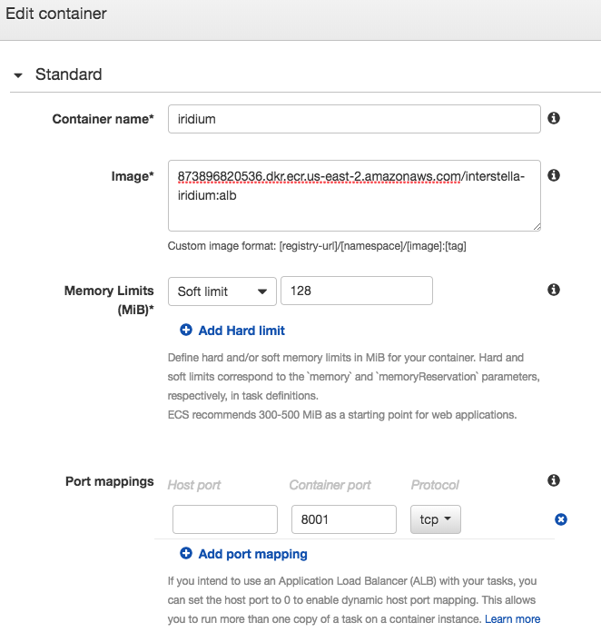

and

Click **Update** and click **Create**.

7\. Now we're ready to tie it all together by creating a a new ECS service for the iridium microservice.  Follow the instructions from step 4 above when you created an ECS service for the monolith, replacing references of "monolith" with "iridium".  

**NOTE:** in "Step 2: Configure Network" of the ALB wizard, once you add the iridium container to the load balancer, rather than select a **Target group name**, leave the drop-down as "create new" and you can use the default name provided or enter your own, e.g. iridium.

Also, notice a path "/iridium*" is created here for path-based routing.  This happens automatically because multiple services are being served from the main ALB listener.  For **Evaluation order** enter **1**. Your configuration should look similar to this:

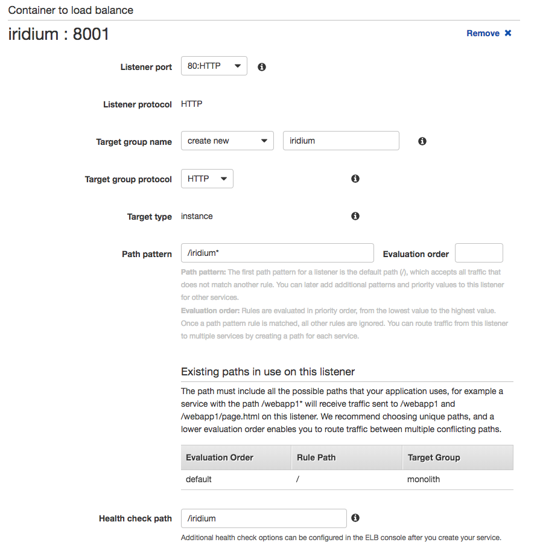

Click **Next step** for this step and step 3.  Click **Create Service**.  Once ECS completes its tasks, click **View Service** to watch the service enter the RUNNING state. 

8\. Ready to test orders to the iridium microservice!  To do this, you will subscribe your ALB endpoint to the SNS iridium topic using the API Key Management Portal (from Workshop Setup Step 3) to start receiving orders.

Open the [API Key Management Portal](http://www.interstella.trade/getkey.html) in a new tab.  If you're not already logged in, you'll need to login with the username and password you created during the Workshop Setup.

Enter the ALB endpoint in the text field using the following format:

<pre>
http://<b><i>ALB_ENDPOINT_DNS_NAME</i></b>/iridium/
</pre>

Click on **Subscribe to Iridium topic** to start receiving orders for the iridium resource.

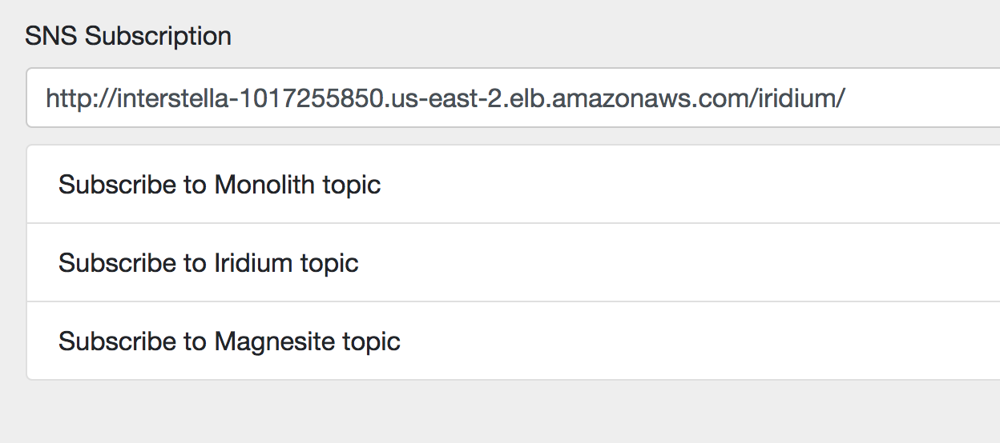

Once the endpoint is subscribed, you should start seeing orders come in as HTTP POST messages to the iridium log group in CloudWatch Logs.  You may notice GET requests in your log stream.  Those are the ALB health checks.  You can also check the monolith log stream to confirm 

9\. 

### Checkpoint: 
In this bonus lab, you implemented an ALB as a way to distribute incoming HTTP orders to multiple instances of Interstella 8888's logistics platform container.  

* * *

### Additional Challenge

If you've got extra time and don't feel like rushing off just yet, try implementing ECS [Service Auto Scaling](http://docs.aws.amazon.com/AmazonECS/latest/developerguide/service-auto-scaling.html). 

* * *

## Finished! Please fill out evaluation cards!

Congratulations on completing the labs or at least giving it a good go.  Thanks for helping Interstella 8888 regain it's glory in the universe!  If you ran out of time, do not worry, we are working on automating the admin side of the workshop, so you will be able to run this lab at your own pace at home, at work, at local meetups, on vacation...ok, maybe that's taking it a bit far.  If you're interested in getting updates, please complete the feedback forms and let us know.  Also, please share any constructive feedback, good or bad, so we can improve the experience for customers like yourselves.

Interstella 8888 has bigger goals of refactoring their software to run as a microservices architecture.  If you liked this workshop and want to take on the challenge of breaking up the logistics platform into to microservices, check out Workshop 2 in the series - Interstella 8888: Monolith to Microservices with Amazon ECS.

* * * 

## Workshop Cleanup

This is really important because if you leave stuff running in your account, it will continue to generate charges.  Certain things were created by CloudFormation and certain things were created manually throughout the workshop.  Follow the steps below to make sure you clean up properly.  

1. Delete any manually created resources throughout the labs, e.g. ALBs (if you got to the bonus lab).  Certain things like task definitions do not have a cost associated, so you don't have to worry about that.  If you're not sure what has a cost, you can always look it up on our website.  All of our pricing is publicly available, or feel free to ask one of the workshop attendants when you're done. 
2. Delete any container images stored in ECR, delete CloudWatch logs groups, and delete ALBs and target groups (if you got to that lab)
3. Delete the CloudFormation stack launched at the beginning of the workshop to clean up the rest.  If the stack deletion process encountered errors, look at the Events tab in the CloudFormation dashboard, and you'll see what steps failed.  It might just be a case where you need to clean up a manually created asset that is tied to a resource goverened by CloudFormation.  